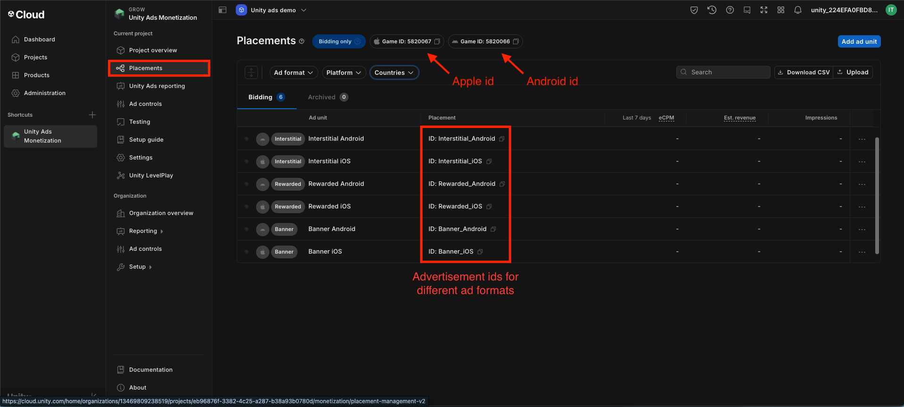

# Advertisement

## **Integrating Unity Ads into Your Flutter App**

This guide walks you through integrating Unity Ads into your Flutter app.

---

### **1. Creating Unity Project**

* Go to the [Unity Ads dashboard](https://id.unity.com/en/account/) and log in or create an account.
* Navigate to the dashboard.

   

* Create a new project and fill in the required details. If you already have a project, skip to Step 2.

   
   

* Open your project, scroll down, and locate **Unity Ads Monetization**.

   
   

* Choose one of the monetization options:
  - **"I will use Unity Ads"**: Displays ads only from Unity's ad network. If no ads are available, nothing is shown.
  - **"I will use Mediation"**: Allows multiple ad networks, increasing fill rates by displaying ads from other sources if Unity has no available ads.

:::info
Using mediation may require additional setup. Read more about it [here](https://docs.unity.com/ads/en-us/manual/ImplementingUnityAdsInMediation).
:::

   

* If you have an existing Unity project and want to copy its ad settings, select **Yes**. Otherwise, choose **No**.

   

* Select **"My app is not live yet"** and click **Add Project**.

:::note
You can add store IDs later when the app goes live.
:::

   

* Unity Ads is now ready for integration.

---

### **2. Integrating Unity Ads**

* Go to your admin panel: *System Settings > App Settings > Unity Ads*.

   

* Add the required Unity Ad IDs in the admin panel and click **Submit**.

   

* Your app will now display Unity Ads.

---

### **3. Enabling Test Mode**

* In your Unity project, go to the **Testing** section and override the default settings to force test mode. This ensures test ads are displayed to all users.

   

* To enable test ads for a specific device:
  - Scroll down and click on **Add Testing Device**.
  - Finding Advertising IDs
    - Android: Settings > Google > Ads
    - iOS: Advertising IDs are not publicly visible. Use a [third-party app](https://apps.apple.com/in/app/my-device-id-by-appsflyer/id1192323960) to find your iOS advertising ID

   

* **Remember to turn off test mode before deploying your app.**

