# PlayStore deployment

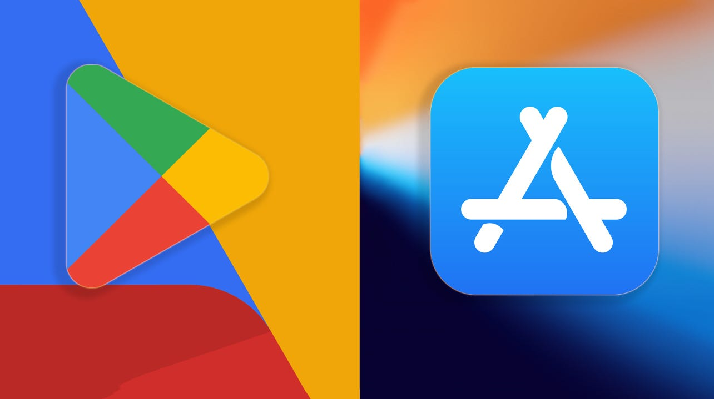

## Overview

This guide provides a comprehensive walkthrough for deploying your Flutter app to the Google Play Store and App Store. We'll cover everything from account setup to app submission, making it easy for non-technical users to follow.

## Prerequisites

Before starting the deployment process, ensure you have:

1. A Google Play Developer Account ($25 one-time fee)
2. Your Flutter app ready for release
3. Basic understanding of using command line/terminal
5. Required assets:
   - App icon (512x512 px)
   - Feature graphic (1024x500 px)
   - Screenshots for different devices (Phone, Tablet)
   - Privacy policy URL
   - Short description (up to 80 characters)
   - Full description (up to 4000 characters)
   - Promotional video (optional)

## Step-by-Step Guide

### 1. Developer Account Setup

1. Visit [Google Play Console](https://play.google.com/console)
2. Choose your account type:
   - Individual developer (requires additional testing requirements)
   - Organization (requires D-U-N-S Number)
3. Complete registration:
   - Pay $25 registration fee
   - Verify your identity
   - Set up payment profile
   - Provide contact information
   - Accept developer agreement
4. For Organization accounts:
   - Obtain D-U-N-S Number (takes 1-30 business days)
   - Submit business verification documents
   - Provide organization details

### 2. App Configuration

Before building your app, update these files:

#### Update pubspec.yaml
```yaml
version: 1.0.0+1  # Format: version_name+version_code
```

> **Important Version Note:**
> - The version format is `version_name+version_code` (e.g., `1.0.0+1`)
> - `version_name` (1.0.0): Represents the public version number shown to users
> - `version_code` (1): Internal version number used by Play Store
> - **For every new release**, you MUST increment the `version_code` by at least 1
> - Example sequence:
>   - First release: `1.0.0+1`
>   - Bug fix update: `1.0.1+2`
>   - Feature update: `1.1.0+3`
>   - Major update: `2.0.0+4`

#### Configure Android Manifest
Navigate to `android/app/src/main/AndroidManifest.xml`:
```xml
<manifest xmlns:android="http://schemas.android.com/apk/res/android">
    <application
        android:label="Your App Name"
        android:icon="@mipmap/ic_launcher">
        <!-- Your app configuration -->
    </application>
</manifest>
```


### 3. Generate App Signing Key

1. Open terminal in project directory
2. Run command:
#### For Mac/Linux  

 ```
 keytool -genkey -v -keystore YOUR-KEYSTORE-FILE.jks -keyalg RSA -keysize 2048 -validity 10000 -alias YOUR-ALIAS
 ```  

#### For Windows  

```
keytool -genkey -v -keystore YOUR-KEYSTORE-FILE.jks -storetype JKS -keyalg RSA -keysize 2048 -validity 10000 -alias YOUR-ALIAS
```
3. Follow prompts to create keystore:
   - Enter password
   - Provide your details
   - Confirm information
4. Store keystore file securely
5. Make backup copies of the keystore

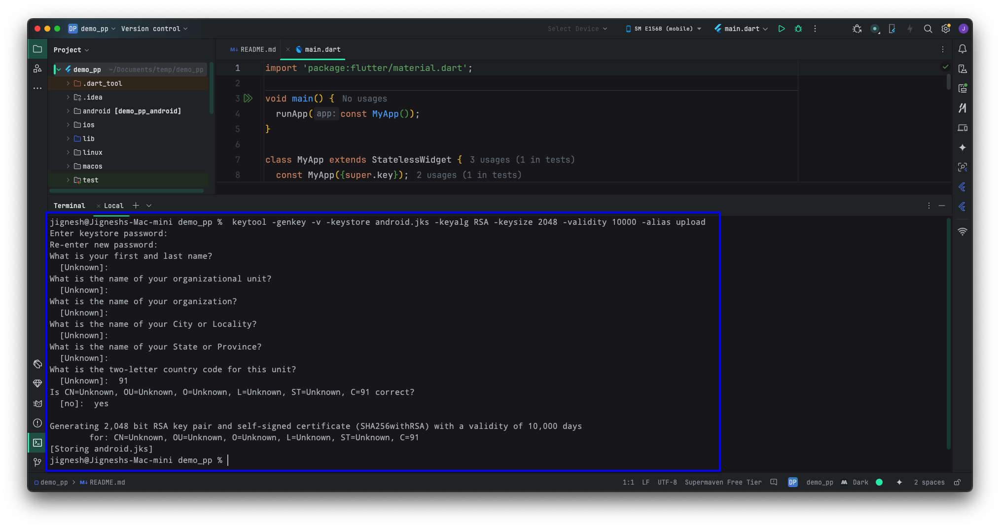

### 4. Configure Key Properties

Create `key.properties` in `android` folder:
```properties
storePassword=<your keystore password>
keyPassword=<your key password>
keyAlias=upload
storeFile=<path to your keystore file>
```

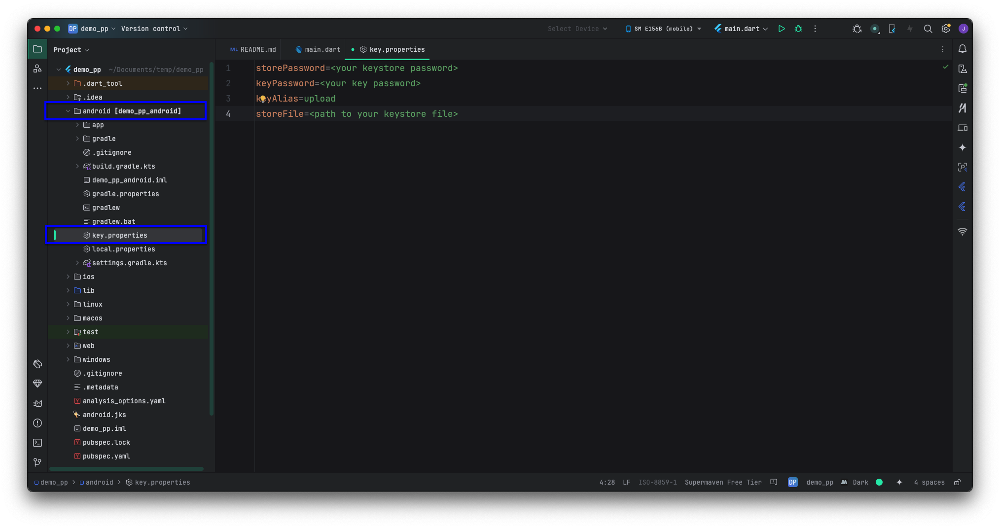

Update `android/app/build.gradle`:
```gradle
def keystoreProperties = new Properties()
def keystorePropertiesFile = rootProject.file('key.properties')
if (keystorePropertiesFile.exists()) {
    keystoreProperties.load(new FileInputStream(keystorePropertiesFile))
}
```

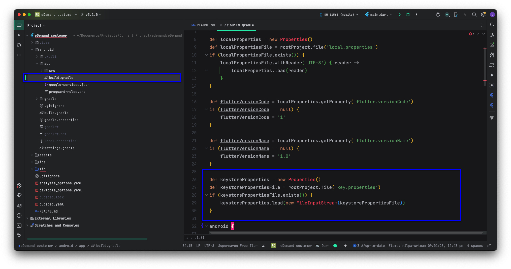


### 5. Build Your App

1. Open terminal in project directory
2. Run command:
```bash
flutter build appbundle --release
```
3. Optional flags:
   - `--obfuscate` - To protect your code
   - `--split-debug-info` - For crash reporting
4. Wait for build completion
5. Find app bundle at: `build/app/outputs/bundle/release/app.aab`

### 6. App Setup

#### Create App Listing


1. Go to Play Console
2. Click "Create app"
3. Fill basic information:
   - App name
   - Default language
   - App/game category
   - Free/paid status
   - Declaration of app content

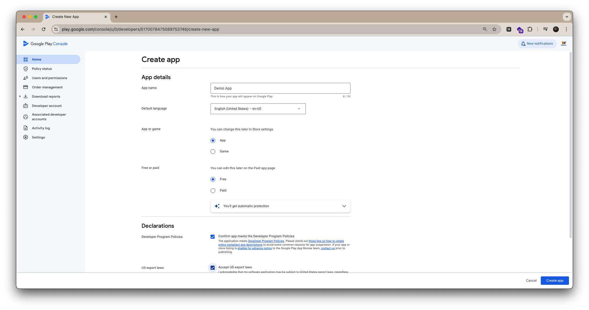

#### Complete Store Listing

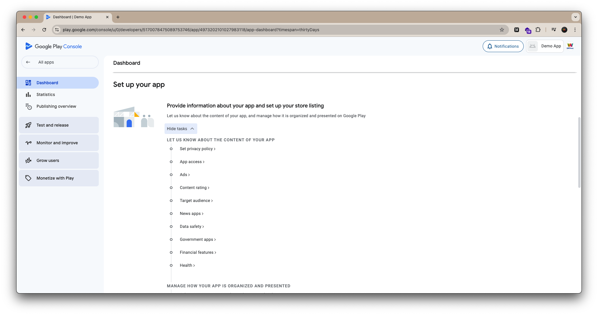

### Let Us Know About The Content Of Your App

#### 1. Set Privacy Policy
- Required for all apps
- Must be accessible without requiring a login
- Include:
  - Data collection and usage
  - Security practices
  - Data deletion policies
  - Contact information

#### 2. App Access
- Specify if app requires login
- Provide test account credentials if needed
- List any special access requirements
- Detail any region restrictions

#### 3. Ads Declaration
- Indicate if your app contains ads
- Specify types of ads used:
  - Banner ads
  - Interstitial ads
  - Rewarded ads
  - Native ads
- Declare ad networks used

#### 4. Content Rating
- Complete questionnaire about:
  - Violence
  - Sexual content
  - Language
  - Controlled substances
  - Miscellaneous
- Rating affects app visibility and target audience

#### 5. Target Audience
- Select target age groups
- Specify if app is designed for children

#### 6. News Apps (if applicable)
- Declare if app provides news content
- Provide publisher information
- Detail editorial policies
- Verify news sources

#### 7. Data Safety
- Declare all data collection:
  - Location
  - Personal information
  - Files and media
  - Device information
- Explain data usage:
  - App functionality
  - Analytics
  - Personalization
  - Advertising
- Detail data security measures
- Specify data sharing practices

#### 8. Government Apps (if applicable)
- Verify government association
- Provide official documentation
- Detail security measures
- Specify jurisdiction

#### 9. Financial Apps (if applicable)
- Declare financial services offered
- Provide licensing information
- Detail security measures
- Specify supported regions

#### 10. Health Apps (if applicable)
- Declare health-related features
- Provide medical disclaimers
- Detail data protection measures
- List any certifications

#### 11. Categorization
- Primary category selection
- Tags and keywords
- Contact details
  - Email address
  - Phone number
  - Website
  - Physical address

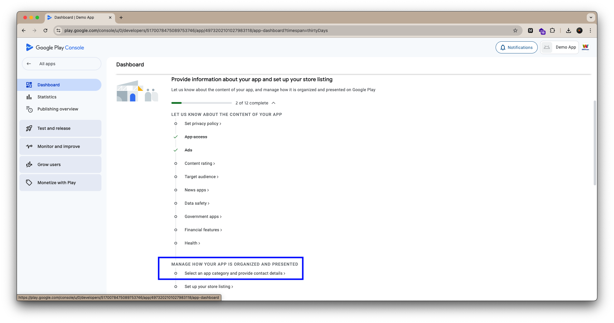

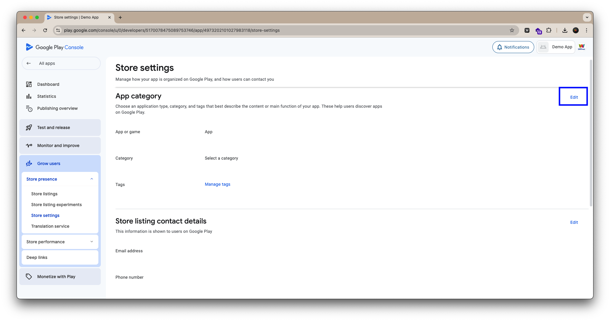

#### 12. Store Listing Details
- App name (30 characters max)
- Short description (80 characters max)
- Full description (4000 characters max)
- What's new in this release


##### 1. Visual Assets
- App icon requirements:
  - 512x512 px PNG
  - Maximum file size: 1MB
  
- Feature graphic:
  - 1024x500 px
  - JPG or PNG
  - Maximum file size: 15MB

- Screenshots:
  - Phone screenshots (minimum 2)
    - 16:9 aspect ratio
    - Minimum 1920x1080 px
  - Tablet screenshots (if supported)
    - 16:9 aspect ratio
    - Minimum 2048x1536 px

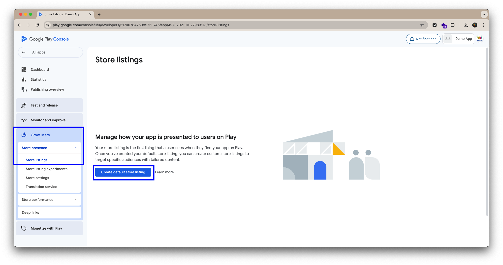

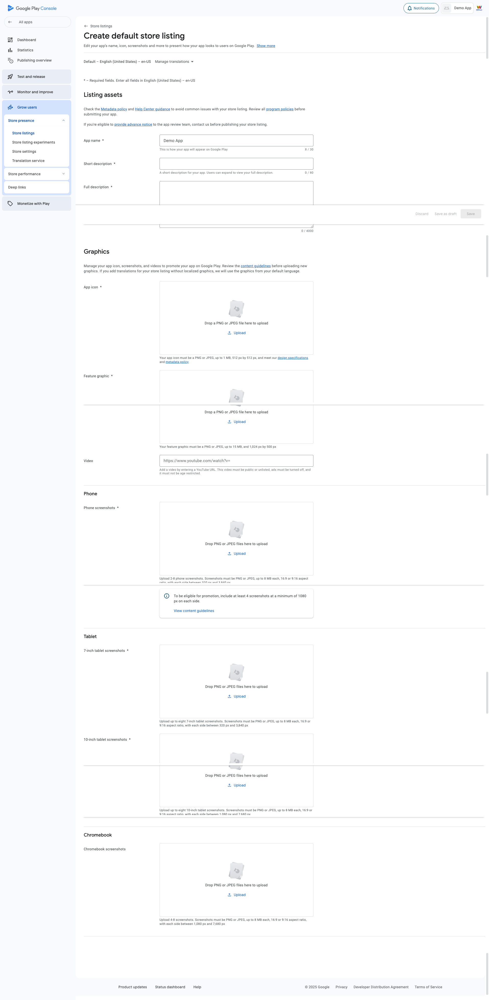

##### 2. Languages and Translations
- Default language selection
- Additional language support
- Localized store listings
  - Translations of descriptions
  - Language-specific screenshots

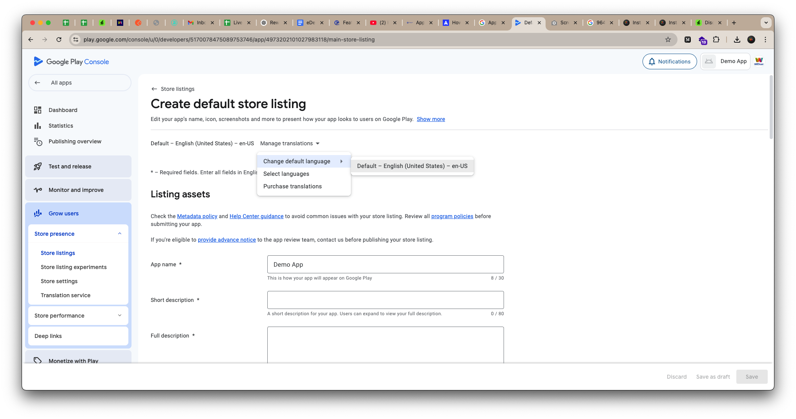


### 8. Testing Setup


#### Understanding Testing Requirements

For personal developer accounts created after November 13, 2023, you must meet specific testing requirements before publishing your app on Google Play:

- Run a closed test with minimum 12 testers
- Testers must be opted-in for at least 14 consecutive days
- Complete an application process for production access

#### Testing Tracks Overview

1. **Internal Testing**
   - Purpose: Quick distribution to trusted testers
   - Features:
     - Available before app setup completion
     - Builds available within seconds
     - Small group of trusted testers
     - Optional but recommended first step
   - No specific requirements to access

2. **Closed Testing**
   - Purpose: Testing with controlled user group
   - Requirements:
     - Must complete app setup
     - Minimum 12 opted-in testers
     - 14 consecutive days of testing
   - Features:
     - Policy compliance verification
     - Bug fixing
     - User feedback collection

3. **Open Testing**
   - Purpose: Public testing on Google Play
   - Requirements:
     - Must have production access
     - App visible on Google Play
   - Features:
     - Anyone can join testing
     - Private feedback collection
     - Public visibility

4. **Production**
   - Purpose: Full public release
   - Requirements:
     - Successful closed testing
     - 12+ testers for 14 days
     - Approved application for production access
   - Features:
     - Full Play Store distribution
     - Access to all Play Console features

### 9. Production Release

1. Create production track
2. Select Countries
3. Upload app bundle
4. Add release notes:
   - What's new
   - Bug fixes
   - Improvements
5. Configure rollout percentage
6. Review all sections:
   - Store listing
   - Content rating
   - Data safety
   - App content
7. Submit for review

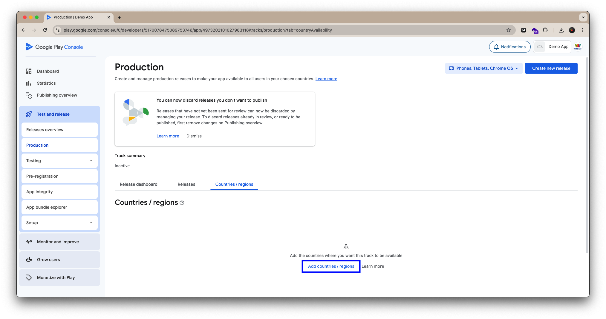

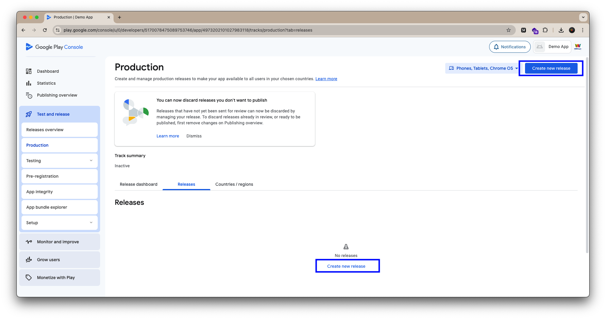

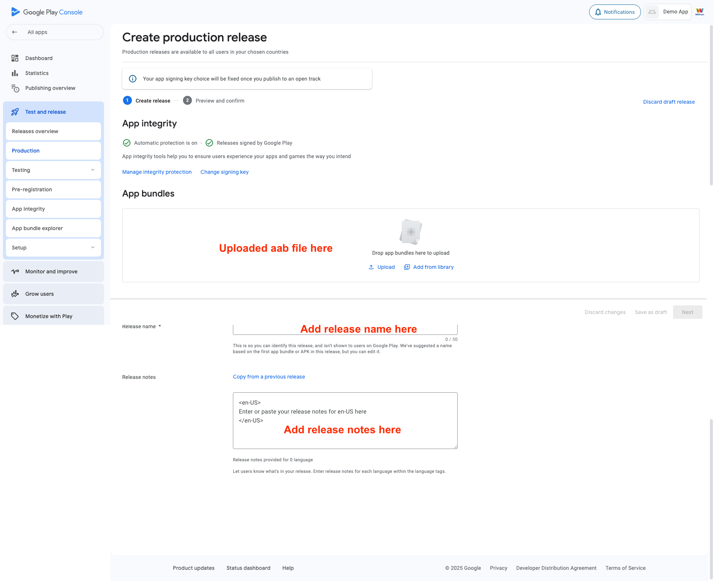

### 10. Post-Release Tasks

1. Monitor app performance
2. Track user feedback
3. Address bug reports
4. Plan updates
5. Maintain compliance


