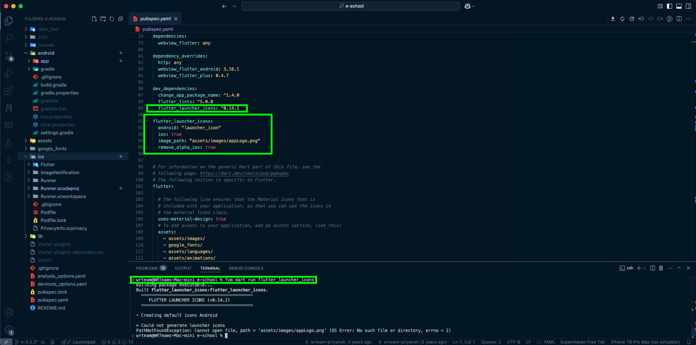
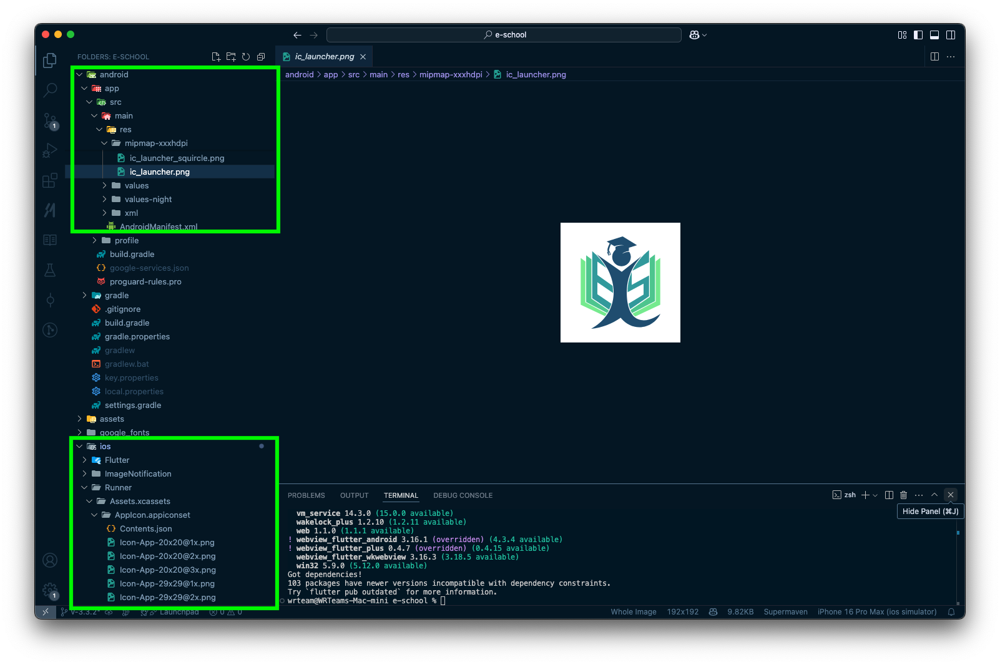

# App Icon Setup

## 📌 Understanding App Icons

App icons are platform-specific image files responsible for displaying your app’s icon on a device after installation. Both **Android** and **iOS** have their own icon requirements, ensuring proper visibility across different screen sizes and resolutions.

To update the app icon, you can:
1. **Manually replace icon resources** in the Android and iOS directories.
2. **Use a package** to automate icon generation.

## 🔧 Automated Method (Recommended)

Use the **Flutter Launcher Icons** package to generate icons easily.

### 1️⃣ Add Dependency

Include the following in your `pubspec.yaml` under `dev_dependencies`:

```yaml
dev_dependencies:
  flutter_launcher_icons: any
```

### 2️⃣ Configure Icons

Add the following configuration in `pubspec.yaml`:

```yaml
flutter_launcher_icons:
  android: "ic_launcher"
  ios: true
  remove_alpha_ios: true
  image_path: "assets/images/ic_launcher.png"
```

#### 🔹 Optional Adaptive Icon Settings (Android Only)
For Android **adaptive icons**, you can add:

```yaml
  adaptive_icon_foreground: "assets/images/ic_launcher_adaptive.png"
  adaptive_icon_background: "#FFFFFF"
  adaptive_icon_monochrome: "assets/images/ic_launcher_monochrome.png"
  adaptive_icon_foreground_inset: 16
```

### 🔍 Explanation of Parameters

| Parameter | Description |
|-----------|-------------|
| `image_path` | **(Required)** Main icon file (512x512 recommended) for both Android and iOS. |
| `ios` | `true` to generate iOS icons, `false` to skip. |
| `remove_alpha_ios` | `true` removes the alpha layer from iOS icons for store upload. |
| `android` | Icon name inside Android `res` folder. |
| `adaptive_icon_foreground` | **(Optional)** Transparent PNG (512x512 or any size) for adaptive icon foreground. |
| `adaptive_icon_background` | **(Optional)** Background color of adaptive icon. |
| `adaptive_icon_monochrome` | **(Optional)** Monochrome icon (black/transparent) for notifications and Android 13+ themed icons. |
| `adaptive_icon_foreground_inset` | **(Optional)** Padding for adaptive icon (default: `16`). |

**Note:** If using **adaptive icons**, ensure the asset paths are registered under `assets` in `pubspec.yaml`.

### 3️⃣ Generate Icons

Run the following command to apply changes:

```sh
dart run flutter_launcher_icons
```



🔹 **Tip:** Delete any existing icons with different shapes to prevent conflicts.

✅ After running this command, your app will have updated icons across Android and iOS!

---

## 🛠️ Manual Method (Optional)

If you prefer not to use the package, you can manually replace icon files in the platform-specific directories.

> 💡 You can use various free tools available online to generate all the required size-specific icon files from a single logo image, which you can then replace directly in the respective folders.



### 📱 Android

1. Prepare icon assets in required resolutions (typically: 48x48, 72x72, 96x96, 144x144, 192x192, etc.).
2. Replace the default icons in the following directory:

```
android/app/src/main/res/
```

Replace files in these subdirectories:

- `mipmap-mdpi/ic_launcher.png`
- `mipmap-hdpi/ic_launcher.png`
- `mipmap-xhdpi/ic_launcher.png`
- `mipmap-xxhdpi/ic_launcher.png`
- `mipmap-xxxhdpi/ic_launcher.png`

For adaptive icons (if applicable), replace:

- `mipmap-anydpi-v26/ic_launcher.xml`
- `mipmap-anydpi-v26/ic_launcher_round.xml`

Also update or create foreground/background layers if needed:

```
res/drawable/ic_launcher_foreground.xml
res/drawable/ic_launcher_background.xml
```

### 🍏 iOS

1. Prepare a set of iOS app icons using [Apple’s required sizes](https://developer.apple.com/design/human-interface-guidelines/ios/icons-and-images/app-icon/).
2. Replace existing icons inside:

```
ios/Runner/Assets.xcassets/AppIcon.appiconset/
```

Replace all `.png` files with correct sizes and update `Contents.json` if necessary (or regenerate with Xcode's asset tool).

✅ After replacing manually, clean and rebuild your project to apply changes:

```sh
flutter clean
flutter pub get
flutter run
```

---