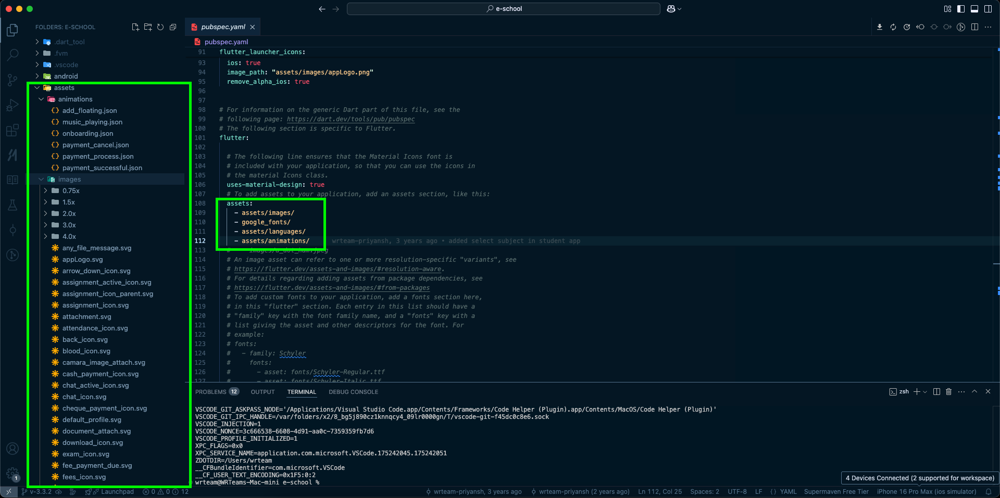

# Assets Management

## 📌 Understanding Assets in Flutter

Assets in Flutter include images, animations, and other resource files used within the app. Proper asset management ensures a seamless UI experience while maintaining performance.

## 🔄 Changing Asset Files

### 1️⃣ Images (SVG, PNG, JPG, etc.)

- To replace an existing image, **use the same name and extension** to avoid modifying the code.
- **Recommended:** Keep the new image size similar to the original for best performance.
- If changing the **name or format**, update its reference in the code.
- **For PNGs:** Some may be divided into multiple size variants (e.g., `2x`, `1.5x`).  
  - Replace all variants **or**  
  - Delete them and use a single image file instead.

### 2️⃣ Animations (Lottie, JSON)

- If the app uses **Lottie animations**, you can modify them by:
  - Changing colors or elements inside the animation tool.
  - Saving the file with the **same name** to avoid modifying the code.
- To add a **new Lottie animation**, replace an existing file with your new `.json` file.
- **Custom folders:** If adding new folders inside `assets/`, ensure they are registered in `pubspec.yaml`.

### 🔍 Registering Assets in `pubspec.yaml`

If you add new asset files or directories, include them in `pubspec.yaml`:

```yaml
flutter:
  assets:
    - assets/images/
    - assets/animations/
```



✅ **Final Check:** Always confirm that new or updated assets are correctly referenced in the code to avoid missing asset errors.
