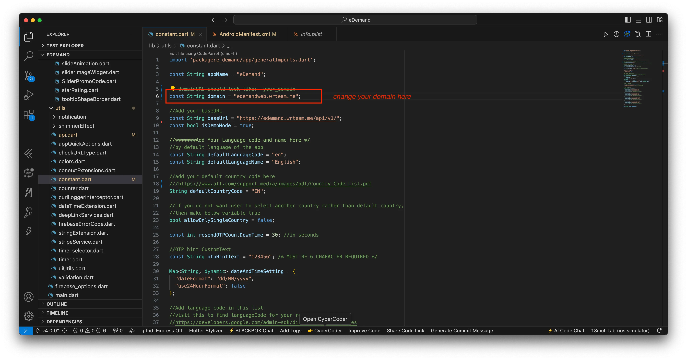
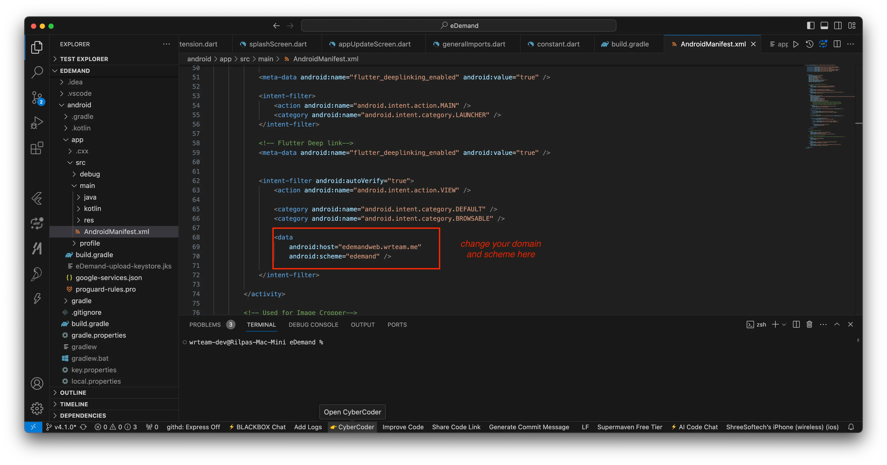
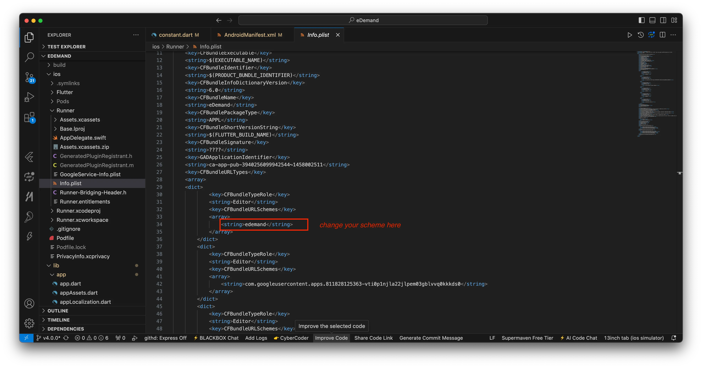

# Deep Link Setup In Flutter Code

Setting up deep links ensures seamless navigation between your web, mobile, and panel applications. Follow these steps carefully to configure deep linking in your Flutter project.

---

## 1️⃣ Add Domain 🌐
- Choose the appropriate domain based on your usage:
  - If using a **web domain**, add the web domain. (If you want to use web for redirect)
  - If using a **panel domain**, add the panel domain.
- Update the necessary files:
  - `lib/utils/constant.dart`

    

  - `android/app/src/main/AndroidManifest.xml`

    

- 🔍 **Ensure correctness:** The domain should match across all configurations.

---

## 2️⃣ Configure Deep Link Scheme 🔗
- Modify the required files:
  - `android/app/src/main/AndroidManifest.xml`

    

  - `ios/Runner/Info.plist`

    

:::note
    Please add your scheme here using a single word in lowercase (e.g., edemand), 
:::

