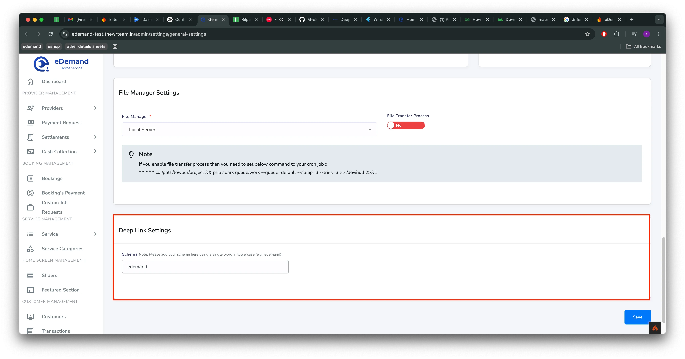
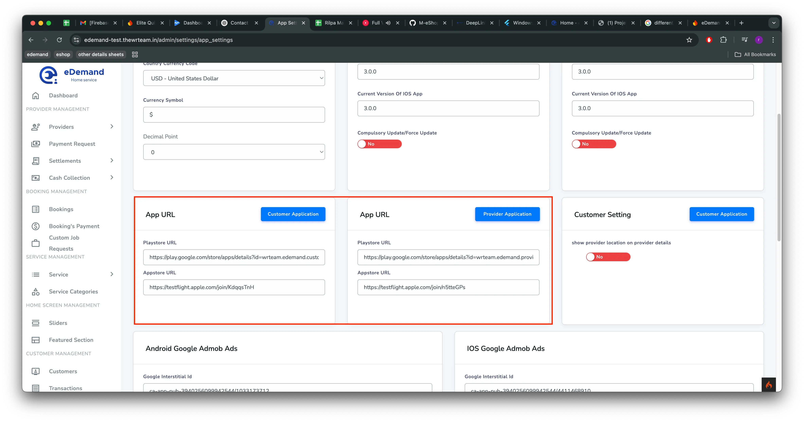

# Deep Link Setup In Panel

## 1️⃣ Panel Settings

Navigate to `System Setting > General Setting > Deep Link Settings` to add scheme for deep linking.

- Save the changes.

  

:::note
Please add your scheme here using a single word in lowercase (e.g., edemand),
:::

- 🚀 **Why?** This step ensures that links open correctly in the respective apps.

---

## 2️⃣ Add Play Store & App Store URLs 📲

- Navigate to `System Setting > App Setting > App URL`
- Add the correct Play Store and App Store links for your app.
- Save the changes.

  

- 🔗 **Why?** These links enable users to be redirected correctly when opening the app from external sources.

---

✅ **Final Check:**

- Ensure all URLs and domains match across different configurations.
- Test the deep linking functionality on both **Android** and **iOS**.
- Verify the app opens correctly from web links and external redirects.

🚀 You're all set! Enjoy seamless deep linking in your app. Happy coding! 🎉
