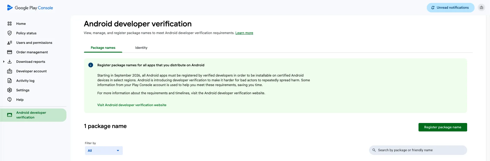
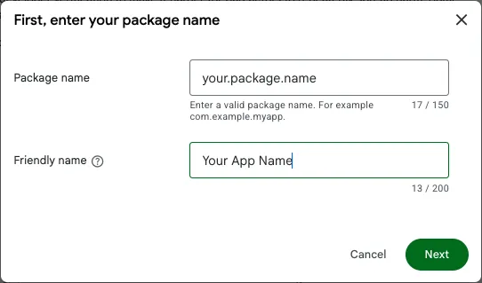
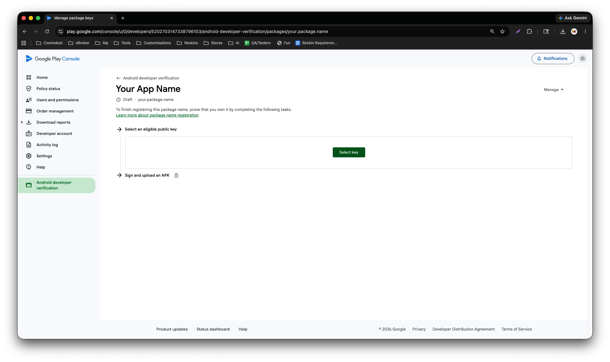
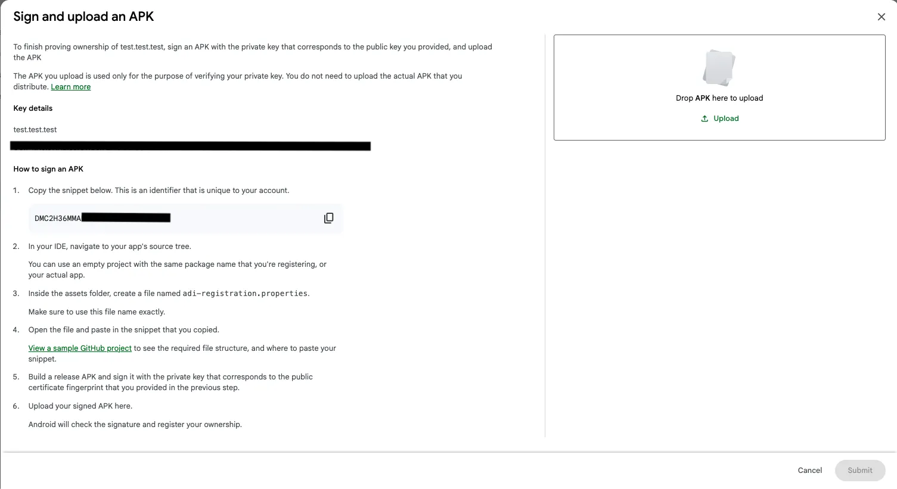

# Android Developer Verification — Package Name Registration

How to register an Android package name for developer verification: provide the package details, register your signing key, prove ownership by uploading a signed APK containing the `adi-registration.properties` file, and track the result.

The process differs slightly depending on whether your package name is **new** (never seen on Android) or **existing** (already has installs). This guide covers both.

## Prerequisites

- The release **signing key** and keystore credentials (store password, key alias, key password)
- JDK installed (`keytool` is included)
- Google Play Console access with identity verification already completed
- Your app's **SHA-256 certificate fingerprint** ([how to obtain it](https://support.google.com/googleplay/android-developer/answer/16641489))

## Step 1 — Provide package name details

Common to both new and existing package names.

1. Open **Google Play Console** and go to the **Android developer verification** page.
2. On the **Package names** tab, select **Register package name**.
3. Enter the package name you want to register.
4. Provide a friendly name for easy identification within Play Console.
5. Select **Next** to proceed.





## Step 2 — Register your signing key

The next step depends on whether the package name is new or existing.

### A. New package name

For a package name never seen on Android, you only need to provide the public certificate.

1. Select **Add key**.
2. Provide the **public key certificate** from your app's signing key pair.
3. Enter your key and select **Add key**.

### B. Existing package name

For a package name that already has installs, you select your key from a list of eligible fingerprints.

1. Select **Select key**.
2. A list of **eligible public certificate fingerprints** is shown — these can be used for direct registration.
3. Scan or search the list for your certificate fingerprint.
4. Select your key and select **Add key**.
5. You return to the registration page, confirming the key has been added.



:::note Key not listed as eligible?
Eligibility follows Google's package-sharing rules (majority key holder, 50+ installs, or first-come-first-served). If your fingerprint is not listed, you can expand the **other keys** list and request to use the package name — but this requires submitting a rationale to Google and may be rejected.
:::

## Step 3 — Prove private key ownership (existing packages)

Existing package names require an APK signed with the private key as proof of ownership.

### 3.1 Copy the snippet

1. Select **Upload APK** to open the ownership verification flow.
2. The screen shows the package name, the selected SHA-256 certificate, and signing guidance.
3. Copy the **snippet** — a unique identifier tied to your developer account.



### 3.2 Create the `adi-registration.properties` file

In your project's source tree, create the file at this exact path:

```
android/app/src/main/assets/adi-registration.properties
```

- Create the `assets` folder if it does not already exist.
- The filename must be **exactly** `adi-registration.properties` — no `.txt` extension.

Paste the snippet into the file and save. Refer to Google's [sample project on GitHub](https://github.com/android/security-samples/tree/main/AndroidDeveloperVerificationAPKSigningExample) to confirm the correct structure.


:::warning
The path must be exact. If the file is in the project root or any other folder, verification will fail.
:::

### 3.3 Build and sign the release APK

```bash
flutter build apk
```

Output: `../build/app/outputs/flutter-apk`

Build a **release APK** signed with the **private key** that corresponds to the registered certificate. The signature — via `jarsigner` or Gradle's `signingConfigs` — serves as the proof of ownership.


:::note Delegated signing keys
If the app's private signing key is delegated to a third-party platform (e.g. Samsung Galaxy Store): build and upload your APK/AAB to that platform, download the final signed APK from it, and upload that downloaded APK to Play Console in Step 3.4.
:::

### 3.4 Upload the APK to Play Console

Return to the verification screen, select **Upload**, locate your signed release APK, and upload it. Android checks the signature and confirms the file contents.


## Step 4 — Track the registration

Android formally registers the package name and links it to your verified developer identity.

- You receive an **email notification** on successful completion.
- You can monitor key and registration status on the **Android developer verification** page.


## Troubleshooting

| Issue | Cause | Fix |
|-------|-------|-----|
| File not found | File placed in project root, not the assets folder | Move it to `android/app/src/main/assets/` |
| Signature mismatch | APK signed with the wrong / debug key | Sign with the private key matching the registered certificate |
| Wrong filename | File saved with a `.txt` extension | Rename to exactly `adi-registration.properties` |
| Key not eligible | Fingerprint not in the eligible list | Expand **other keys** and submit a request with a rationale |

:::note
For **Expo / managed workflow** projects, the standard JS bundler does not copy files into the native assets folder. Use a config plugin or `prebuild` so the file lands in `android/app/src/main/assets/` inside the final APK.
:::

## Reference

- [Registering Android package names — Play Console Help](https://support.google.com/googleplay/android-developer/answer/16761053)
- [Obtaining your SHA-256 certificate fingerprint](https://support.google.com/googleplay/android-developer/answer/16641489)
- [Sample project on GitHub](https://github.com/android/security-samples/tree/main/AndroidDeveloperVerificationAPKSigningExample)