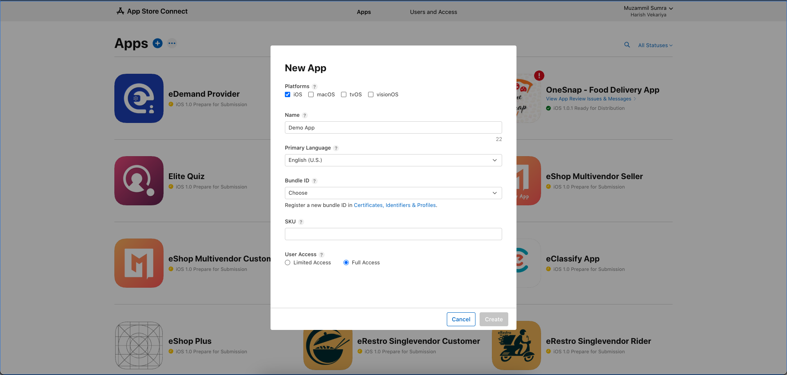
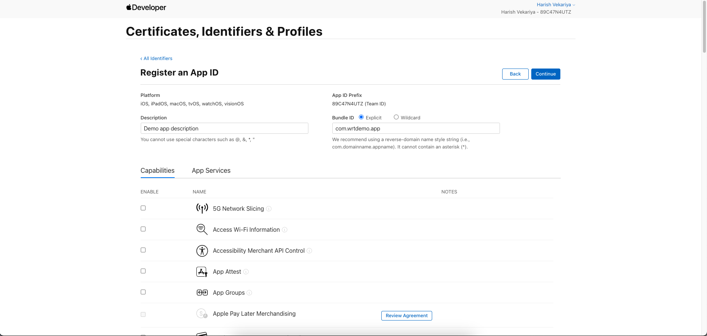
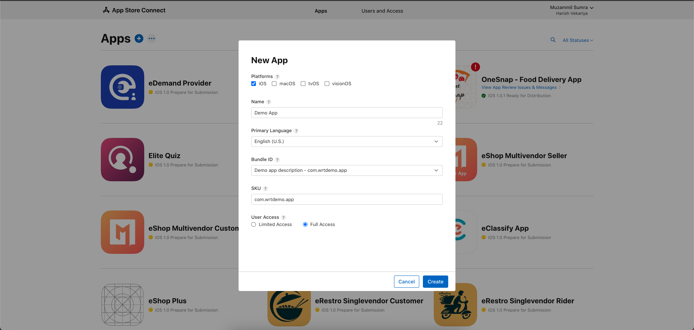
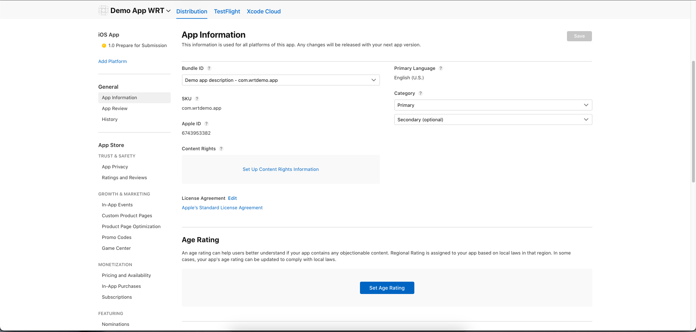
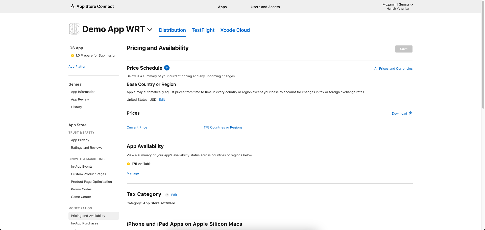
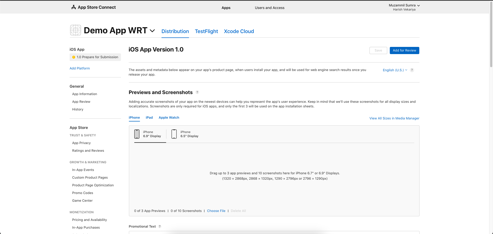
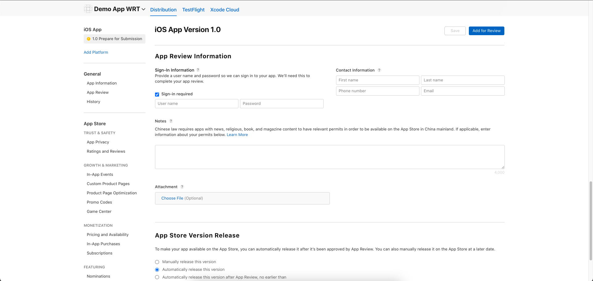
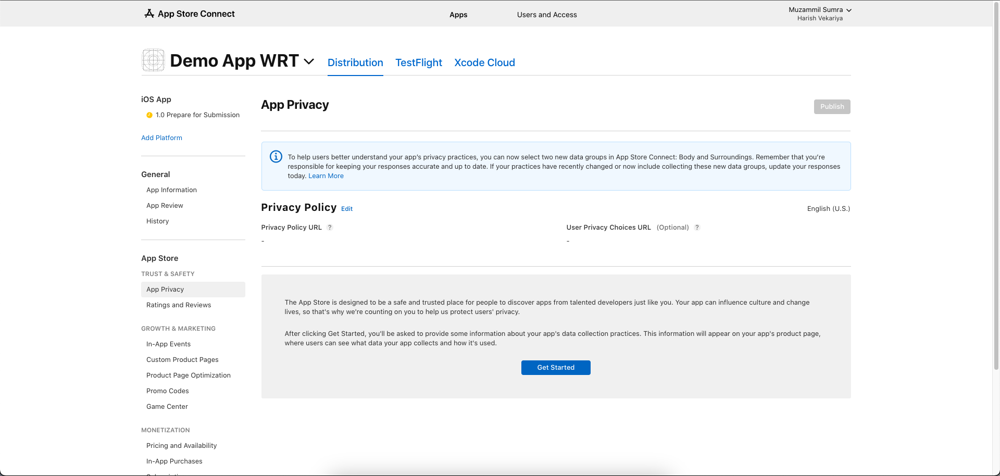

# iOS App Deployment

[//]: # (Header image showing App Store and Flutter logos side by side)
<!--  -->

## Prerequisites

Before starting the iOS deployment process, ensure you have:

1. Apple Developer Account ($99/year)
2. Your Flutter app ready for release
3. Mac computer with Xcode installed
4. Required assets:
   - App icon (1024x1024 px)
   - Screenshots for different devices (iPhone, iPad)
   - Privacy policy URL
   - App description
   - Keywords
   - Support URL
   - Marketing URL (optional)
   - App Store Connect account setup

## Step-by-Step Guide

### 1. Developer Account Setup

1. Visit [Apple Developer Program](https://developer.apple.com/programs/)
2. Enroll in the program:
   - Pay $99 annual fee
   - Complete organization verification
   - Set up payment profile
   - Provide contact information
3. Configure App Store Connect:
   - Create app record
   - Set up basic information
   - Configure app capabilities

### 2. App Configuration

Before building your app, update these files:

#### Update pubspec.yaml
```yaml
version: 1.0.0+1  # Format: version_name+version_code
```

> **Important Version Note:**
> - The version format is `version_name+version_code` (e.g., `1.0.0+1`)
> - `version_name` (1.0.0): Represents the public version number shown to users
> - `version_code` (1): Internal version number used by App Store
> - **For every new release**, you MUST increment the `version_code` by at least 1


### 3. Generate App Signing Certificate

1. Open Xcode
2. Go to Xcode → Settings → Accounts
3. Add your Apple ID
4. Create certificates:
   - Development certificate
   - Distribution certificate
5. Create provisioning profiles:
   - Development profile
   - App Store profile

<!--  -->

### 4. Build Your App

1. Open terminal in project directory
2. Run command:
```bash
flutter build ipa --release
```
3. Optional flags:
   - `--obfuscate` - To protect your code
   - `--split-debug-info` - For crash reporting
4. Wait for build completion
5. Find IPA file at: `build/ios/ipa/YourApp.ipa`

### 5. App Store Connect Setup

#### Create App Record

1. Log in to [App Store Connect](https://appstoreconnect.apple.com)
2. Click "My Apps"
3. Click "+" to create new app
4. Fill basic information:
   - App name
   - Bundle ID
   - SKU
   - User Access



5. Choose or create Bundle ID:
:::note
    Bundle ID Creation can also be done automatically via Xcode if you enable automatic signing in your project settings.
:::
   - Click "Certificates, Identifiers & Profiles" in Apple Developer portal
   - Go to "Identifiers" section
   - Click "+" to register new Bundle ID if needed
   - Format: com.companyname.appname (e.g., com.example.myapp)
   - Select capabilities required for your app
   - Register the Bundle ID
   - Use this Bundle ID in both Xcode and App Store Connect





<!-- 
 -->


<!--  -->

#### Complete App Information

1. App Information:
   - Privacy Policy URL
   - Support URL
   - Marketing URL (optional)
   - App Store category
   - Age rating




2. Pricing and Availability:
   - Price tier
   - Available territories
   - Release date




3. App Store Screenshots:
   - iPhone screenshots (6.5" Display)
   - iPad screenshots (if supported)
   - App Preview videos (optional)



4. App Description:
   - Name (30 characters max)
   - Subtitle (30 characters max)
   - Keywords (100 characters max)
   - Description (4000 characters max)
   - What's New in This Version


6. App Review Information


   i. Contact Information:
      - First name
      - Last name
      - Phone number
      - Email address

   ii. Demo Account (if login required):
      - Username/email
      - Password
      - Any special instructions

   iii. Notes for Review Team:
      - App functionality description
      - Special setup instructions
      - Test account details
      - Known issues or clarifications
      - Beta/sandbox environment details




7. App Privacy
- Enter privacy policy URL
- You need to complete data collection process. If your app requires any data collection then you will need to select respective options. 


### 7. Production Release

1. Open the iOS folder in Xcode.

1. In the project navigator, select Runner under Targets, then go to the Signing & Capabilities tab. Sign in with your Apple Developer account.


2. Update the version and build number.


Then, go to the Build Settings tab, scroll down, and update the values for FLUTTER_BUILD_NAME and FLUTTER_BUILD_NUMBER.


3. Select Any iOS Device as the target.


4. To upload the app to the App Store, go to Product > Archive. Once the archive is complete, you can proceed with the upload.


5. Log in to App Store Connect, select the build you uploaded from Xcode, and click "Add for Review" to submit it for review.


### 8. Post-Release Tasks

1. Monitor app performance
2. Track user feedback
3. Address bug reports
4. Plan updates
5. Maintain compliance

## Important Notes

- Keep certificates and provisioning profiles safe
- Ensure app complies with App Store guidelines
- Test thoroughly before submission
- Keep version numbers updated
- Monitor review status
- Back up all signing certificates

## Troubleshooting

Common issues and solutions:

1. **Build Fails**
   - Check Flutter version
   - Update dependencies
   - Verify Xcode version
   - Check signing configuration
   - Validate bundle identifier

2. **Upload Issues**
   - Verify certificates
   - Check version number
   - Validate assets
   - Confirm bundle size
   - Check API compatibility

3. **Review Rejection**
   - Read rejection reasons
   - Make necessary changes
   - Update compliance
   - Resubmit with updates


## Need Help?

If you encounter issues:

1. Check [Flutter Documentation](https://flutter.dev/docs/deployment/ios)
2. Visit [Apple Developer Documentation](https://developer.apple.com/documentation/)
3. Consult Flutter community
4. Review [App Store Guidelines](https://developer.apple.com/app-store/review/guidelines/)
5. Contact Apple Developer Support

Remember: First deployment may take longer. Subsequent updates will be faster.

