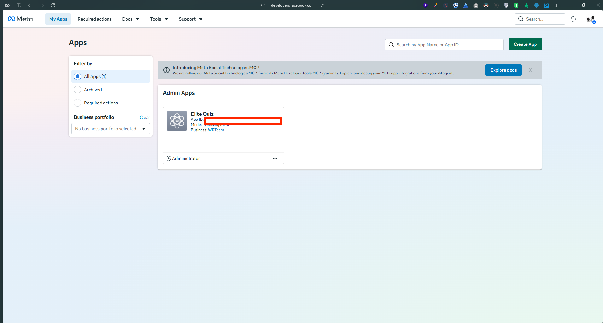
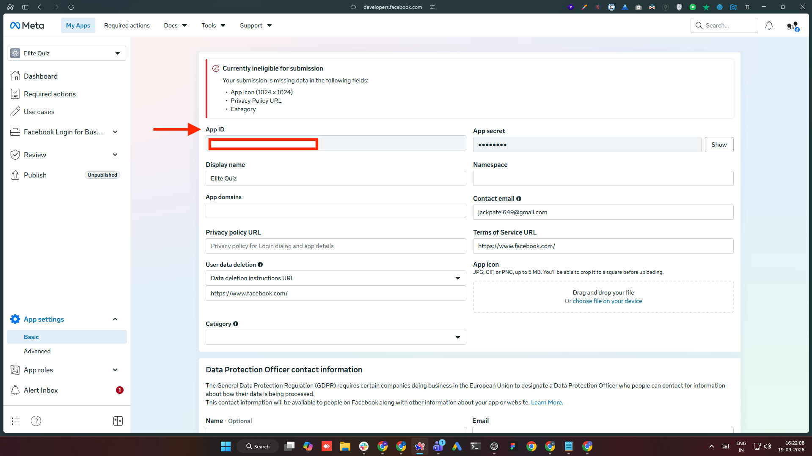
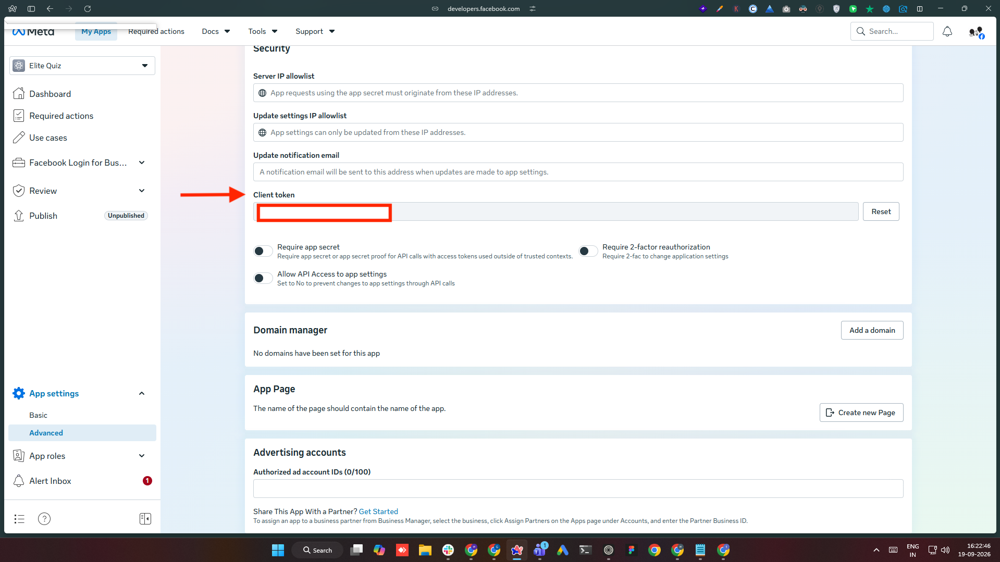
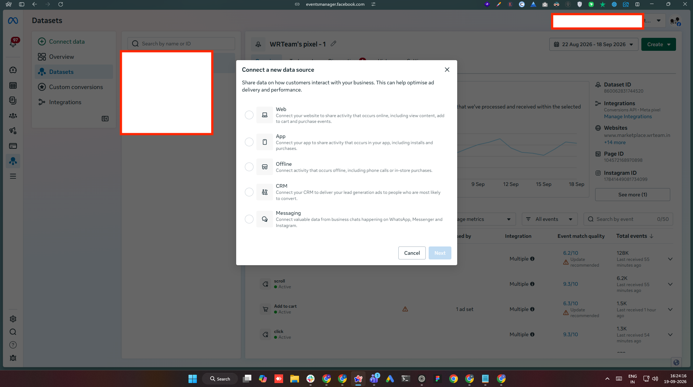
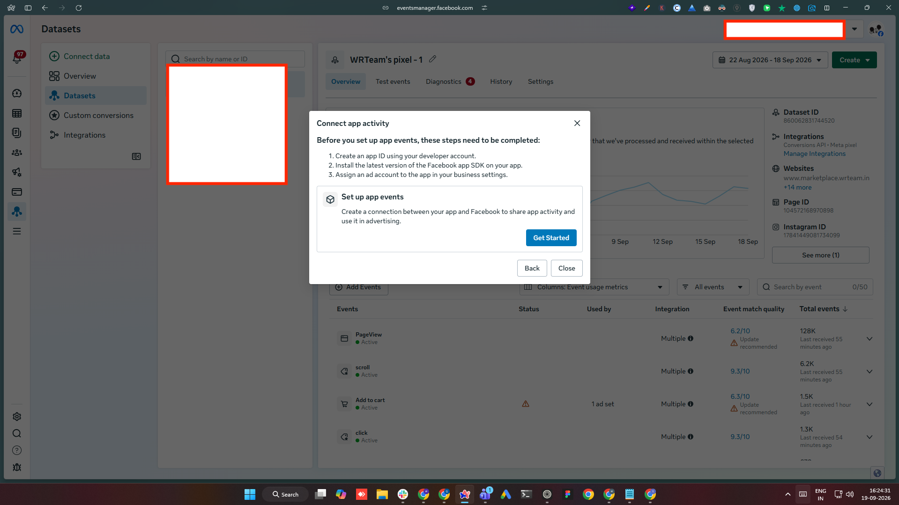
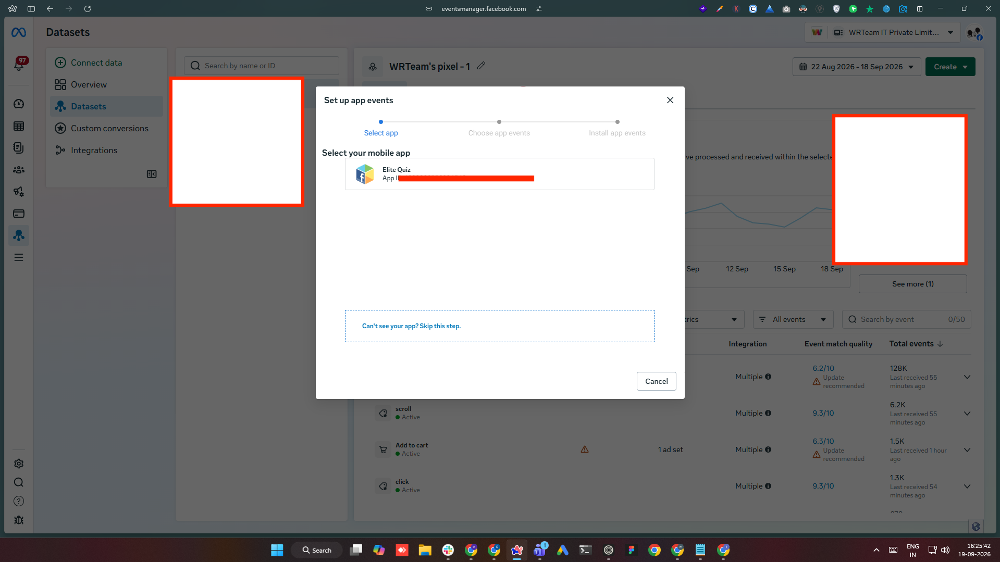
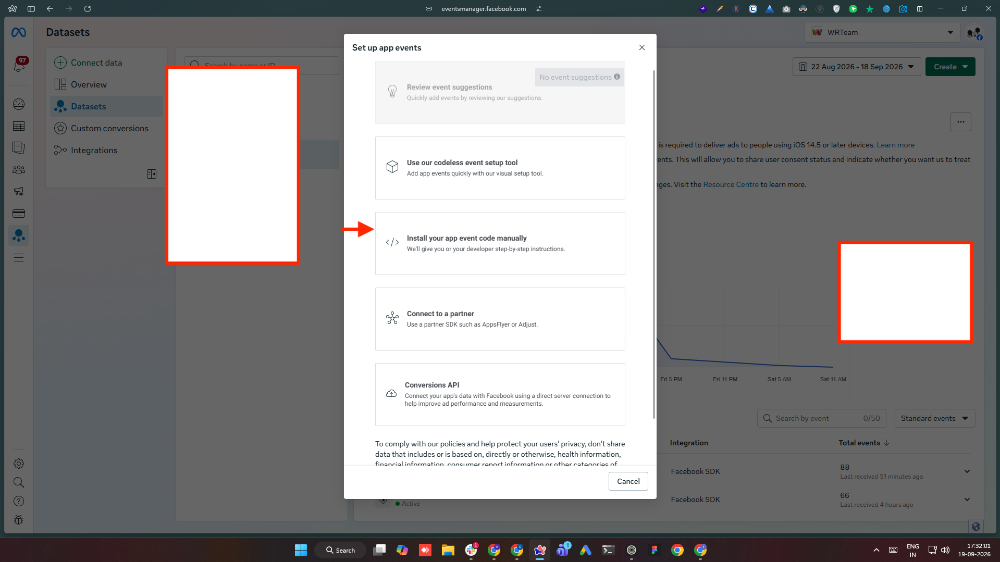
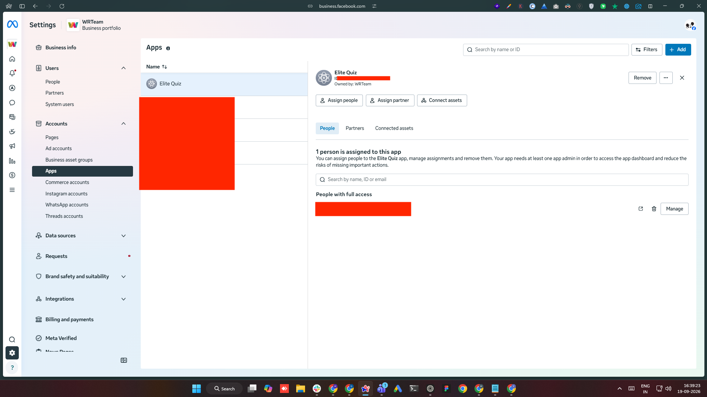

# Facebook App Events

## Overview

The app sends app events (installs, opens, in-app actions) to **Meta Events Manager** for ad measurement and attribution. The integration is already built into the app — you only need to plug in your own Facebook app's **App ID** and **Client Token**.

## 1. Get Your App ID and Client Token

1. Go to [developers.facebook.com](https://developers.facebook.com) and log in with the Facebook account that should own this app.
2. Click **My Apps** and open your app (or **Create App** if you don't have one yet).



3. In the left sidebar, open **App settings → Basic**. The **App ID** is at the top of the page.



4. Open **App settings → Advanced**, scroll to the **Security** section, and copy the **Client token**.



Keep both values handy — you'll add them to the Android and iOS configuration below.

## 2. Android Setup

Open `android/app/src/main/res/values/strings.xml` and replace the placeholder values with your own App ID and Client Token:

```xml
<string name="facebook_app_id">YOUR_FACEBOOK_APP_ID</string>
<string name="facebook_client_token">YOUR_FACEBOOK_CLIENT_TOKEN</string>
```

Nothing else needs to change on Android — `AndroidManifest.xml` already references these two string resources.

## 3. iOS Setup

Open `ios/Runner/Info.plist` and replace the placeholder values for these three keys:

```xml
<key>FacebookAppID</key>
<string>YOUR_FACEBOOK_APP_ID</string>
<key>FacebookClientToken</key>
<string>YOUR_FACEBOOK_CLIENT_TOKEN</string>
<key>FacebookDisplayName</key>
<string>YOUR_APP_NAME</string>
```

`FacebookDisplayName` is just the app name Meta shows in its own dashboards — use whatever you've named the app.

After saving, run `pod install` inside the `ios/` folder before your next iOS build so CocoaPods picks up the Facebook SDK.

## 4. Rebuild the App

A full rebuild is required after changing native config — a hot reload/hot restart is not enough:

```bash
flutter clean
flutter run
```

## 5. Connect the App to Meta Events Manager

Before events show up anywhere, your app has to be added as a **data source** in Events Manager — this is a one-time setup, separate from the App ID/Client Token you already added to the code.

1. Go to [Meta Events Manager](https://business.facebook.com/events_manager2), open (or create) the dataset you want app events to flow into, and click **Connect data**. Choose **App** as the data source type.



2. If the dataset shows a **Connect app activity** prompt instead, click **Get Started**.



3. In the **Set up app events** wizard, select your app from the list — it's matched by the App ID from step 1.



4. On the **Install app events** screen, choose **Install your app event code manually**.



:::note App not showing up in the list?
Your app must be linked to the same Meta Business account as the dataset. Check **Business Settings → Accounts → Apps**, confirm the app is listed, and that your account has access to it.


:::

## 6. Verify Events Are Arriving

Facebook's SDK automatically logs standard events (app installed, app activated) as soon as it detects the App ID / Client Token above — no extra code is required for that part.

To confirm events are actually arriving:

1. Go back to [Meta Events Manager](https://business.facebook.com/events_manager2) and select this app's dataset.
2. Open the **Test Events** tab and run the app on a device/emulator — you should see events appear there in real time (within a few seconds).

Alternatively, Meta's **App Ads Helper** browser extension shows the same real-time event stream and can be used instead of Test Events.

:::note
Events Manager's aggregated dashboards (outside Test Events) are delayed and deduplicated — don't rely on them to verify a fresh setup.
:::

## 7. Registering Custom Events

Standard install/open tracking is automatic (see step 6) — no code needed. For anything app-specific (a quiz completed, an exam submitted, a purchase), the app logs a **custom event** with whatever data is relevant.

:::note
The App ID / Client Token are **not secrets** — they're bundled into the compiled app binary and visible to anyone who inspects it. This is expected and matches how Meta's SDK is designed to work.
:::
