# Firebase Billing

## 🔼 Upgrade from the Firebase Spark Plan to the Blaze Plan
:::note
(regarding Firebase OTP setup — if you’ve already set up billing for Firebase OTP previously, there’s no need to repeat that step. Please ensure that your billing account is linked to your app project. If it isn’t, kindly follow these steps(1 to 3 point))
:::

1. Log in to the Firebase Console. In the lower left, you will see that your project is listed on the Spark plan. Click the upgrade button.
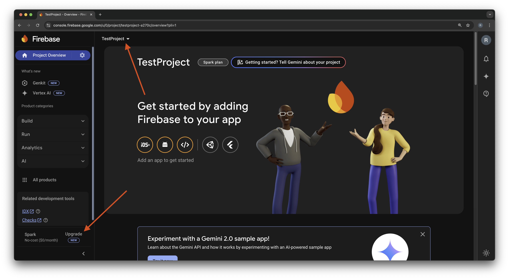

2. Select the Blaze plan.
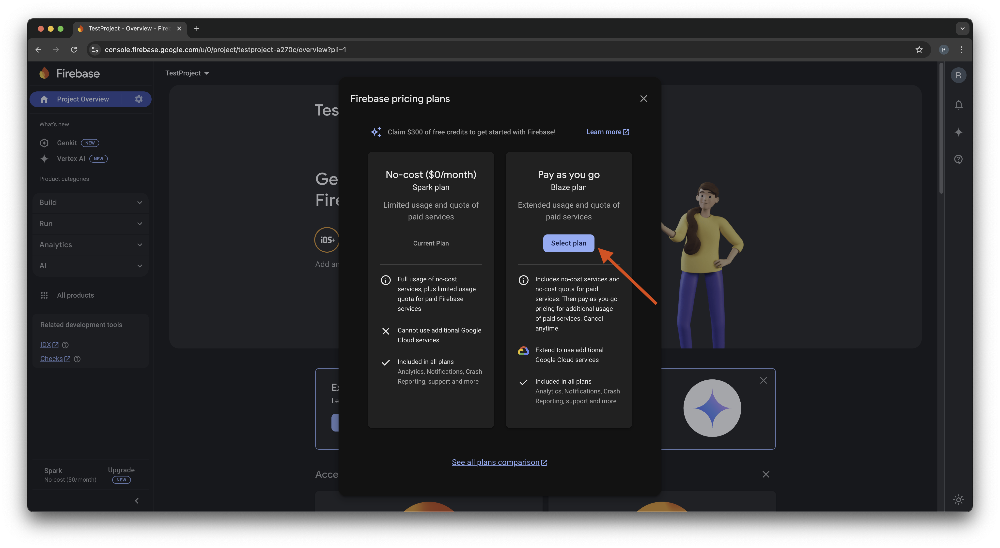

3. Select a billing account. Then click Continue and Purchase. You are now on the Blaze plan.
    - For details on how to create a billing account, please see the Google Billing instructions:
    🔗[click here](https://docs.firerun.io/getting-started/upgrading-from-the-firebase-spark-plan-to-the-blaze-plan-tled)

    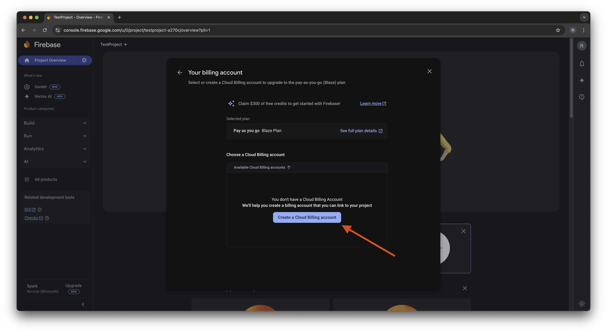
    - Select your country instead of India.
    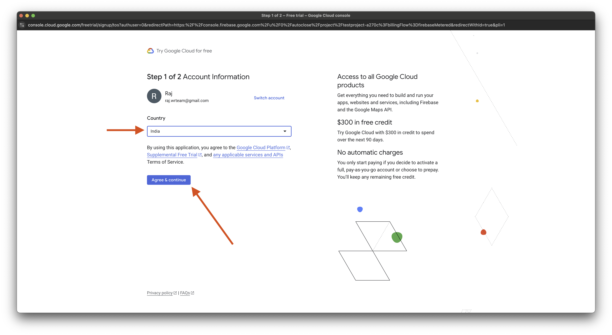
    - Select your existing payment profile, or click **'Create New Payment Profile'** if you don’t have one.
    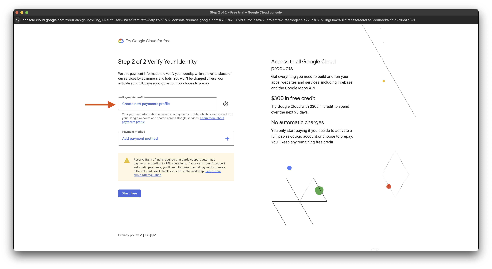
    - Add detail of paymnet account.
    
    - Select your existing payment method, or click 'Add Payment Method' if you don’t have one.
    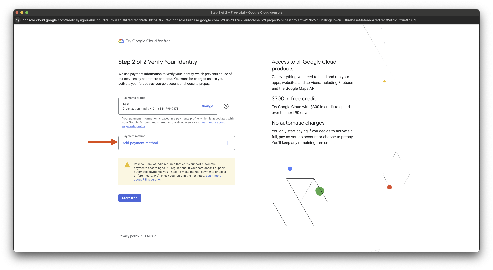
    - Select your payment method.
    

## Setting Up Billing on Map, and Place API Keys
Firebase provides a range of services, some of which require billing to be enabled, especially Google Maps, and Places API. Follow these steps to ensure proper billing setup.

## 1️⃣ Set Up Billing
:::note
(regarding Firebase OTP and Maps setup — if you’ve already set up billing for Firebase OTP previously, there’s no need to repeat that step. Please ensure that your billing account is linked to your app project. If it isn’t, kindly follow these steps(1 to 6 point))
:::

1. Go to the Firebase Console.
2. Select your project.
3. In the left-hand menu, click on **Project Settings**.
4. Under the **Billing** section, click **Go to Billing Account**.
5. If you don’t have a billing account, **click Create Billing Account** and follow the prompts to add your payment method.
6. Link the billing account to your project.

## 2️⃣ Enable Required APIs
1. In the Firebase Console, go to **Project Settings > Cloud Messaging > Manage Service Accounts**.
2. Click on **Google Cloud Console**, then select your project.
3. In the Cloud Console, navigate to **APIs & Services > Library**.
4. Enable the following APIs:
    - **Maps SDK for Android** (to display maps on Android devices)
    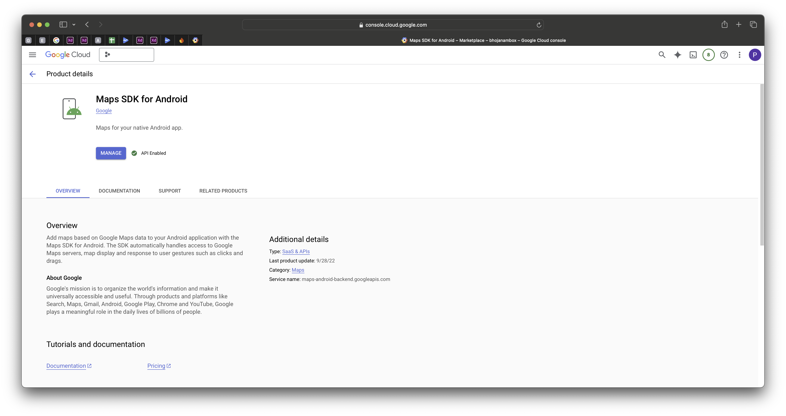
    - **Maps SDK for iOS** (to display maps on iOS devices)
    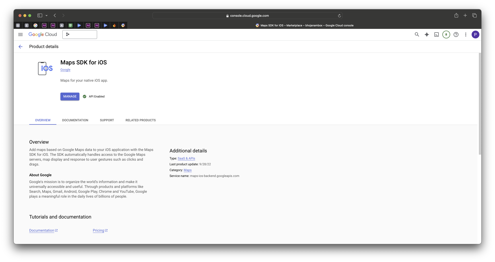
    - **Geocoding API** (optional, for converting addresses into coordinates)
    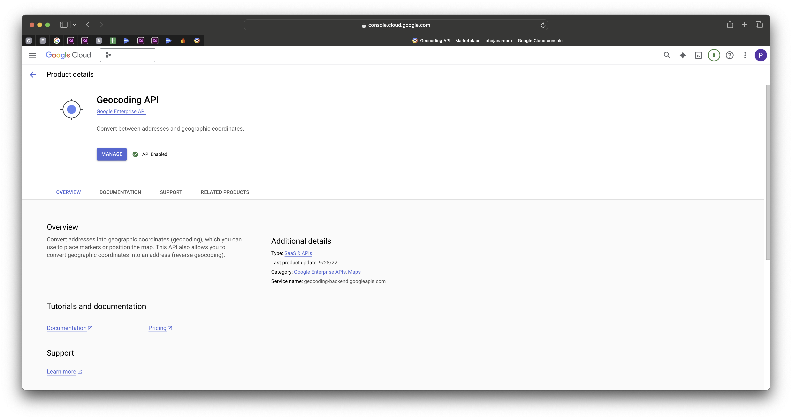
    - **Places API** (for location search and autocomplete)
    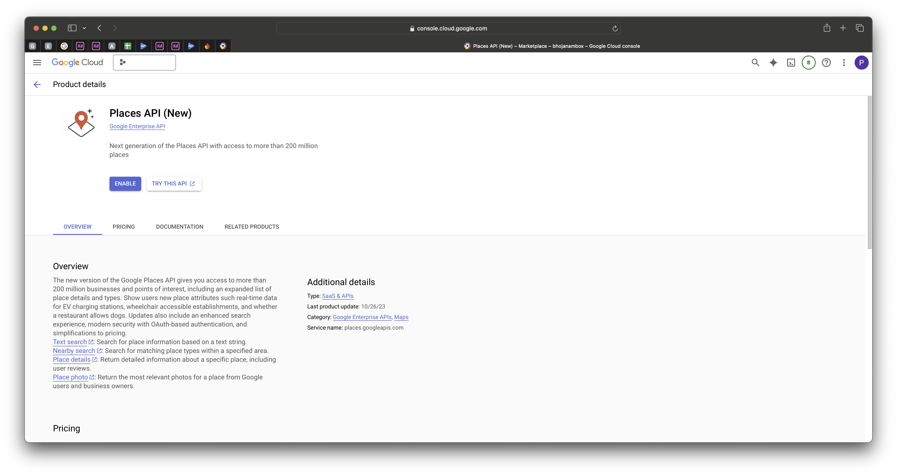
    - **Routes API(Distance Matrix API is now deprecated, so it's necessary to enable the Routes API.)** (for calculated distance between location)
    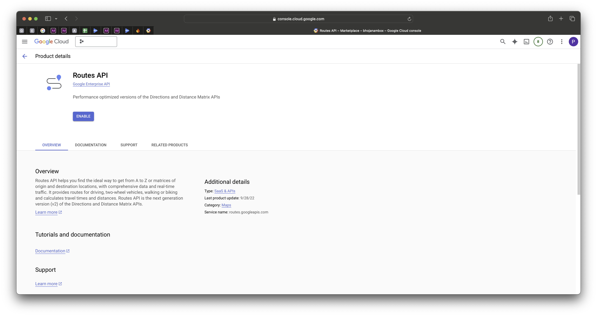
    - **Maps JavaScript API** (for displaying maps)
    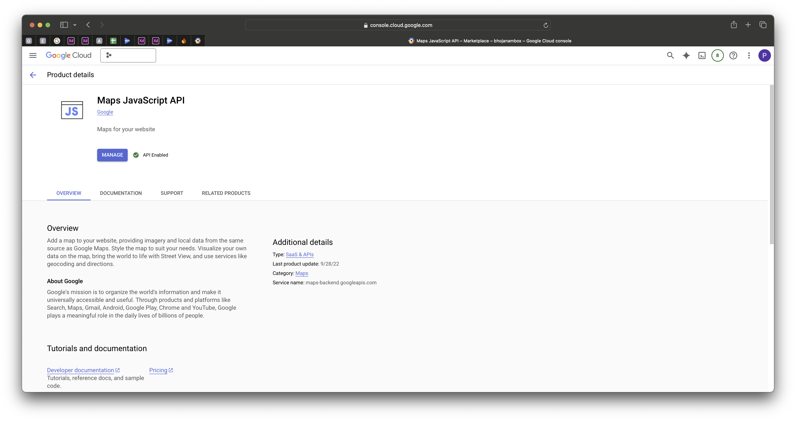

## 3️⃣ Set Up API Keys
1. In the Cloud Console, navigate to **APIs & Services > Credentials**.
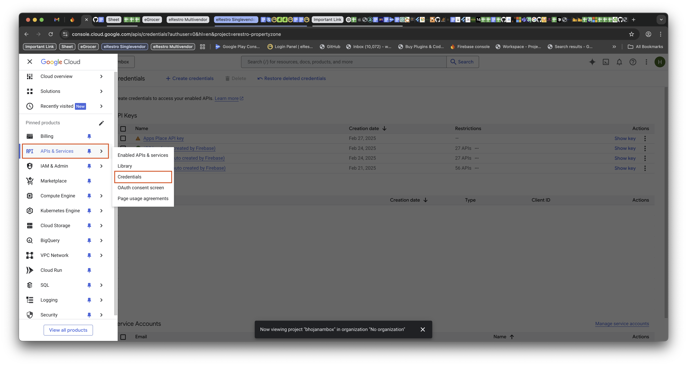
2. Click **Create Credentials** and select **API Key**.
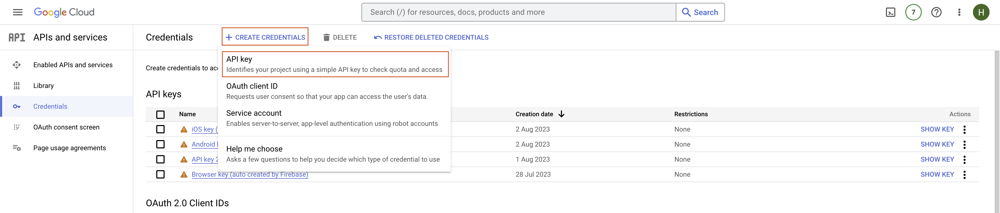

    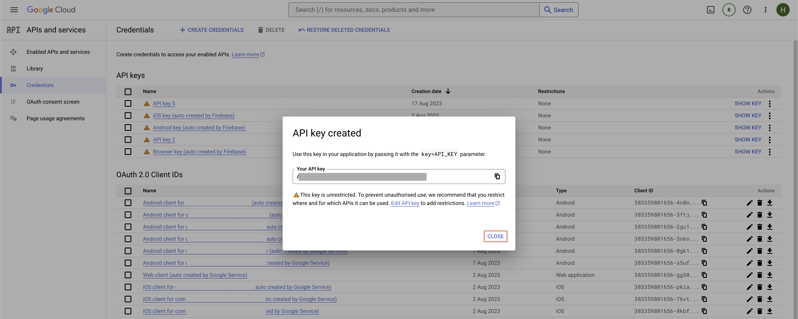
3. API Key Management for **Android**, **iOS**, and **Place Services**(remove Restrictions from android, ios and place search api new create), Please Ignore if Already **Unrestricted**.
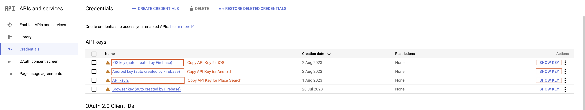

## 4️⃣ Add the API Key to Your App
1. In your Flutter app, locate the **AndroidManifest.xml** (for Android) or **AppDelegate.swift** (for iOS).
    - Insert your API key:
    ```
    <meta-data
    android:name="com.google.android.geo.API_KEY"
    android:value="YOUR_ANDROID_MAP_API_KEY" />
    ```

    - `android/app/src/main/AndroidManifest.xml`

    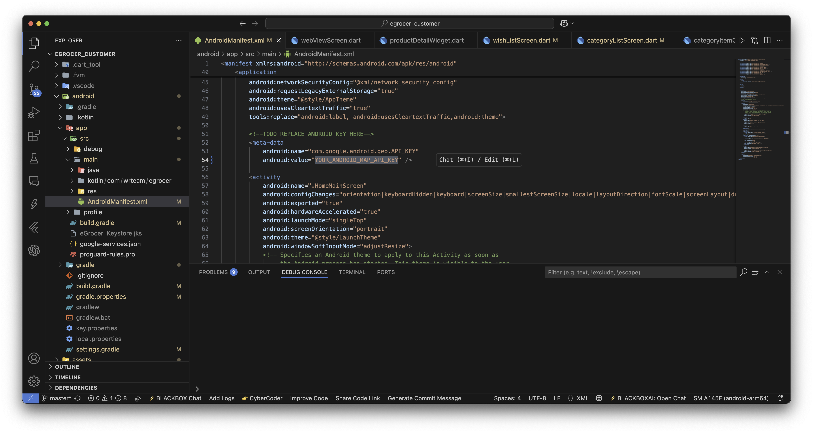

2. For iOS, add the key in **AppDelegate.swift**:   
    ```
    GMSServices.provideAPIKey("YOUR_IOS_MAP_API_KEY")
    ```

    - `ios/Runner/AppDelegate.swift`

    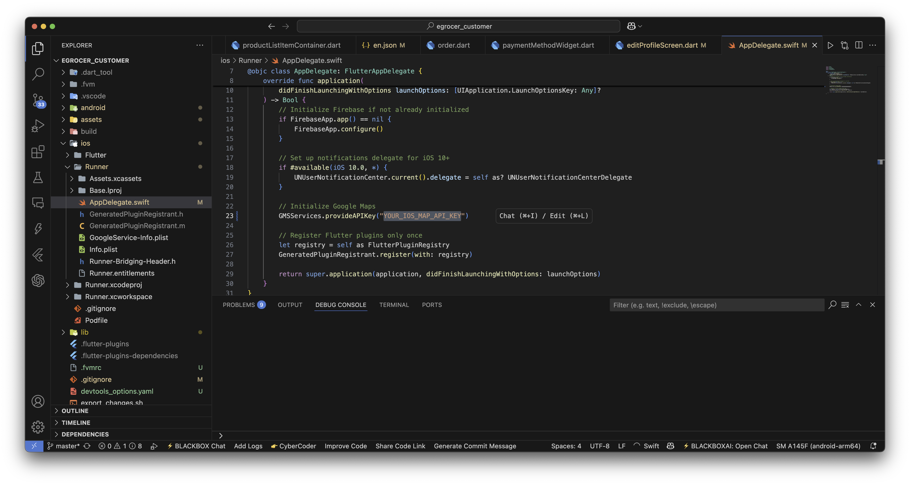

## 5️⃣ Verify Billing Setup
1. In the Cloud Console, go to **Billing** and ensure the project is linked to your billing account.
2. Test OTP, Map, and Place APIs in your app to ensure they work properly.


