# Firebase Setup  
## 🔥 How to Set Up Firebase in Your Flutter App  
:::caution
You must use the **same Firebase project** for the app, web, and panels to ensure seamless integration.
:::

---

### ⚙️ Step 1: Install Firebase CLI

Before creating a Firebase app from Flutter, you must install **Firebase CLI.**

**📌 Follow the official guide to install Firebase CLI:**  
🔗 [Firebase CLI Installation Guide](https://firebase.google.com/docs/cli)

---

### 🏗️ Step 2: Create a Firebase Project
1️⃣ Open **Firebase Console** and click **Create a Project**.  

  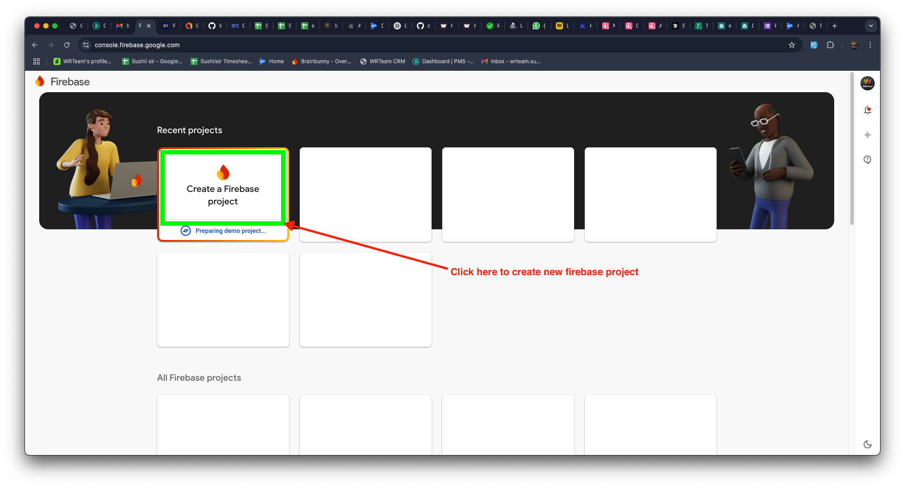

2️⃣ Enter your **project name** and press **Continue**.  

  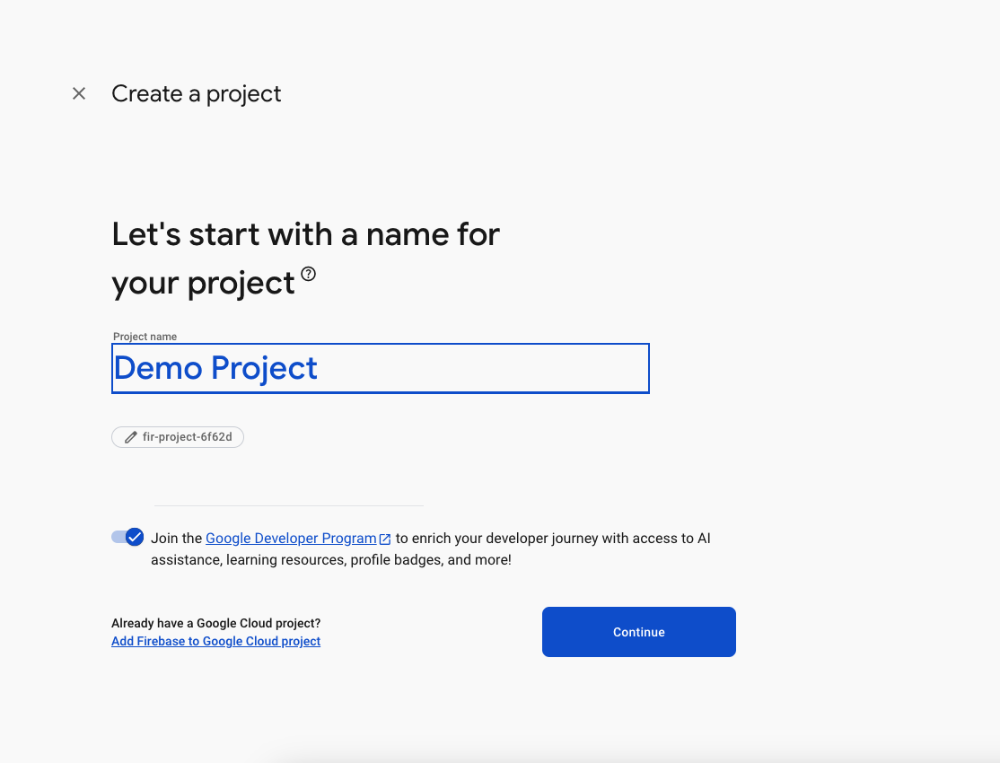  

3️⃣ Press **Continue** on the next screen.  

  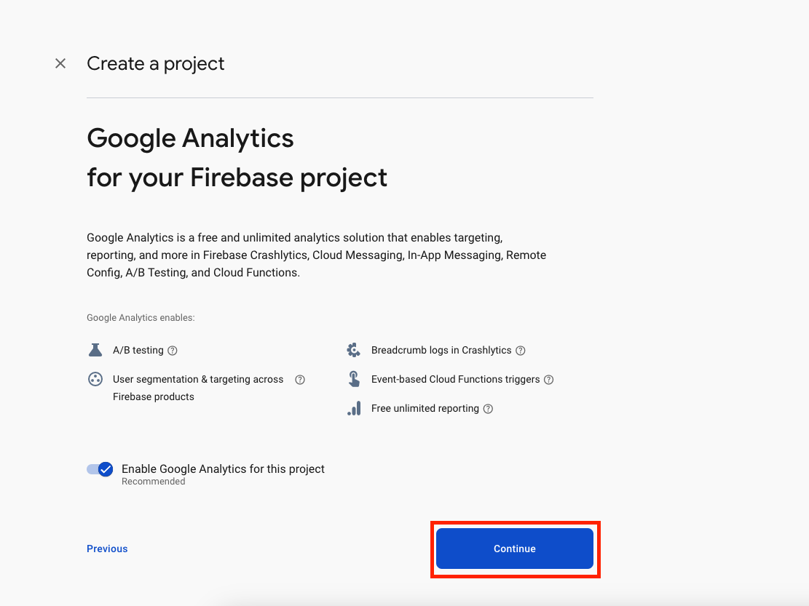  

4️⃣ Click **Create Project** and wait for the setup to complete.  
5️⃣ Once done, press **Continue**.  

---

### 📱 Step 3: Create a Firebase App for Flutter  
1️⃣ Select **Flutter** as the app type (refer to the image below).  

  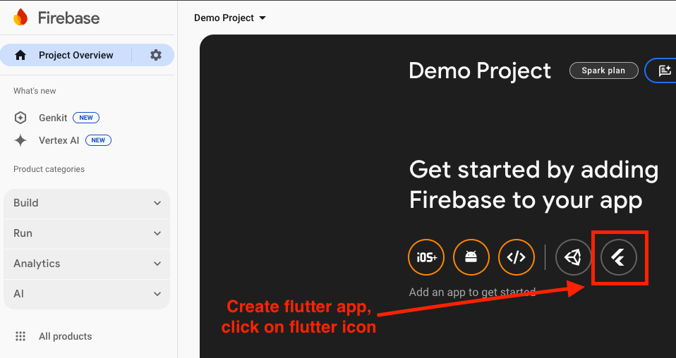  

2️⃣ Press **Next** to continue.  

  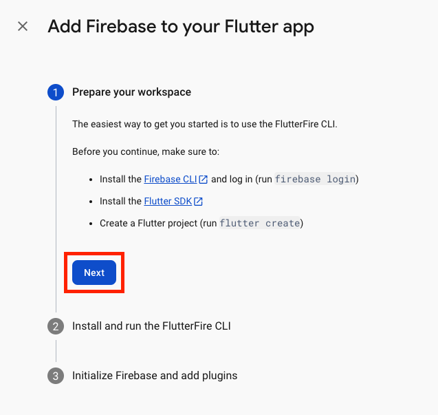  

---

### 🖥️ Step 4: Log in to Firebase via Terminal  
1️⃣ Open **CLI Terminal (e.g., Visual Studio Code, Android Studio)**.  
2️⃣ Run the following command to log in `(if you are already logged in, then you can move to the step 5)`:
```
firebase login
```  

  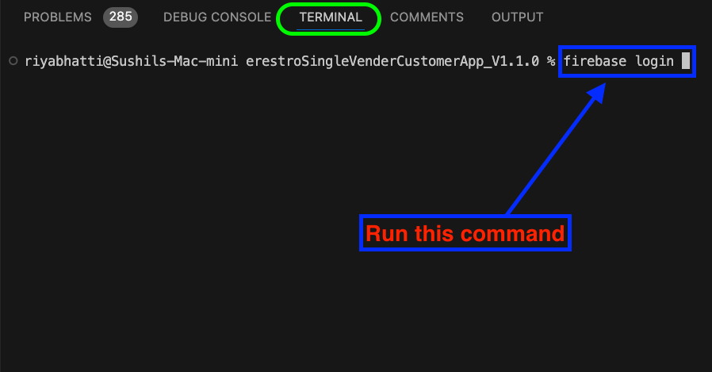  

3️⃣ A browser window will open—log in to your Firebase account.  
4️⃣ When prompted, allow Firebase to collect CLI usage data by entering `YES` and pressing Enter.

---

### 🛠️ Step 5: Run Firebase Initialization Commands  
1️⃣ In **CLI Terminal (e.g., Visual Studio Code, Android Studio)**, run the first Firebase setup command (as per the provided image).  

  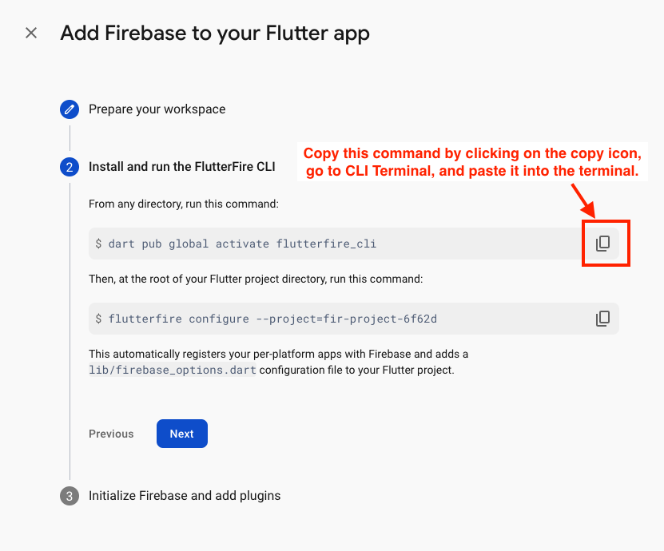  

2️⃣ Run the second Firebase setup command in the terminal.  

    

3️⃣ When the terminal asks for confirmation, press Enter. 

  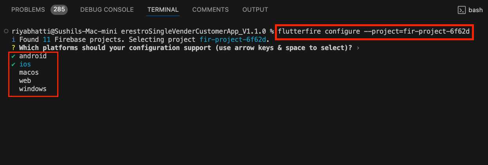  

4️⃣ If prompted again, press Y to confirm.  

  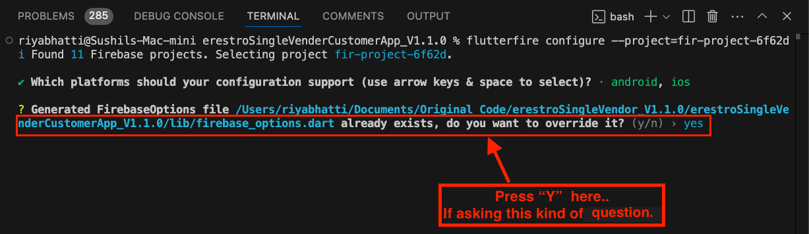  

---

### 🎉 Step 6: Finalizing Firebase Setup  
1️⃣ Press **Next** to continue.  

  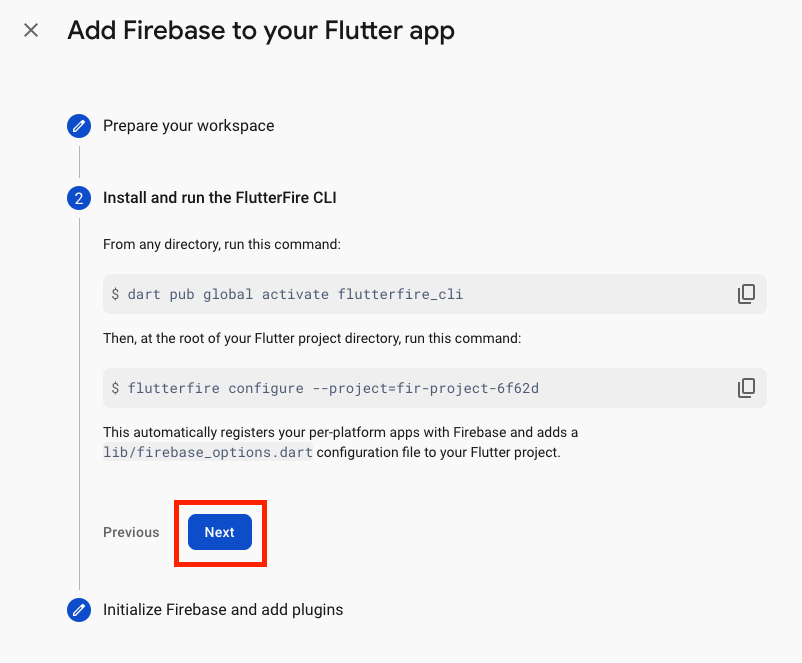  

2️⃣ Click **Continue to Console**.  

  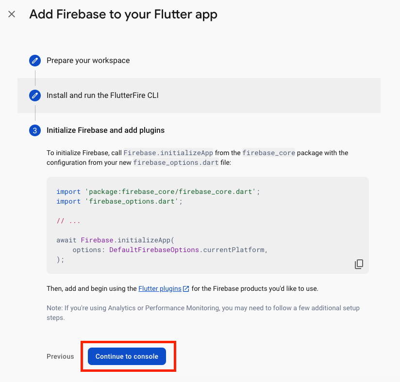  
  

## 🔥 Firebase Authentication  

This document provides step-by-step instructions to enable **Firebase Authentication** in your Flutter app.  

---

## 🔑 Enable Firebase Authentication  
1️⃣ **Open Firebase Console** 
 - Go to [Firebase Console](https://console.firebase.google.com/)
 - Select your project  

2️⃣ **Enable Authentication Methods**
 - Go to **Authentication** > **Sign-in method**
 - Click **Add New Provider**
 - Enable the required sign-in methods (e.g., Apple, Phone, Google)  

   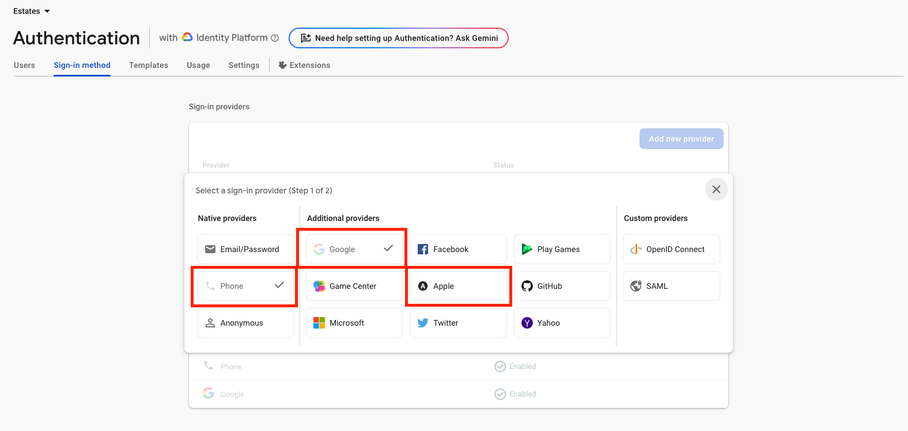  


3️⃣ **Enable SMS Authentication for specific regions**  
 - Go to **Authentication** > **Settings**  
 - Go to **SMS region policy** in SMS section  
 - Click on **allow**  
 - Add the regions where you want to enable SMS authentication for OTP log-in.  

   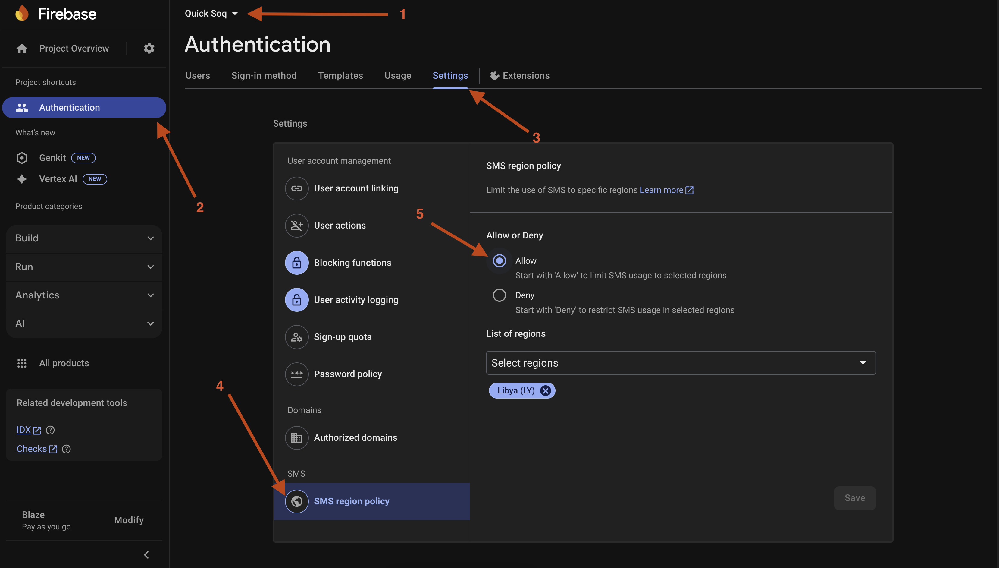  
     
---

## 🔒 Add SHA1 & SHA256 Keys in Firebase  
### 🔹 For Android  
  **For Android, you need to add a total of three pairs of SHA-1 and SHA-256 keys to the Firebase CLI by following the steps below**.  

#### 🔸 For Debug Build  

1️⃣ Open your project code in **CLI Terminal (e.g., Visual Studio Code, Android Studio)**  
2️⃣ Run the following command in your project's root folder: 
#### For Mac/Linux
```
cd android  
./gradlew signingReport   
```
#### For Windows  

```
cd android  
gradlew signingReport
```
3️⃣ Copy the SHA1 and SHA256 keys from the output  

  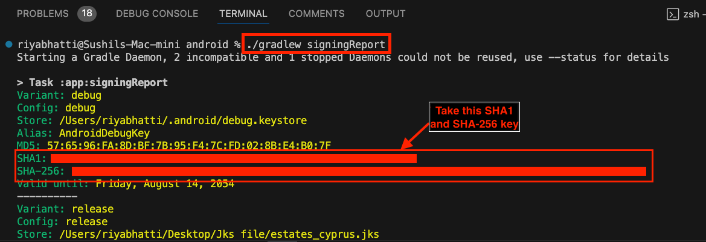  

4️⃣ Open Firebase Console  
5️⃣ Go to Project Settings > General > Android App  
6️⃣ Add the copied SHA1 and SHA256 keys  

  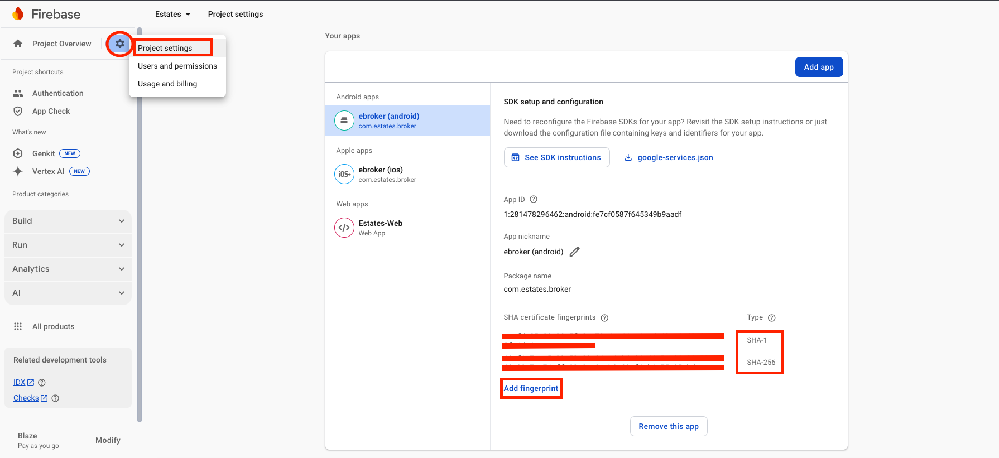  

---

#### 🔸 For Release Build

 1️⃣ To generate a **keystore file**, run the following command in your project's terminal:  

#### For Mac/Linux  

 ```
 keytool -genkey -v -keystore YOUR-KEYSTORE-FILE.jks -keyalg RSA -keysize 2048 -validity 10000 -alias YOUR-ALIAS
 ```  

#### For Windows  

```
keytool -genkey -v -keystore YOUR-KEYSTORE-FILE.jks -storetype JKS -keyalg RSA -keysize 2048 -validity 10000 -alias YOUR-ALIAS
```
 :::note
 - You can replace **"YOUR-KEYSTORE-FILE.jks"** with your preferred filename, but ensure you keep the **".jks"** extension. Similarly, you can change **"YOUR-ALIAS"** as needed, but make sure to remember it.  

 - During this process, you will be prompted to set a password; please note that the password characters won't be visible on the screen.  

 - Additional information may be requested, but you can simply press Enter to skip those as they are optional fields.
 :::

2️⃣ Create a file named **key.properties** in your project's `android` folder.  
3️⃣ Add the following details, which correspond to the information you used in the previous step:

```
storePassword=[your-password-from-previous-step]
keyPassword=[your-password-from-previous-step]
keyAlias=[your-alias-from-previous-step]
storeFile=[your-keystore-file-location]
```
:::note
Replace the placeholders ("[]" brackets) with the actual details you used.
:::

4️⃣ You need to add the release SHA keys to Firebase  
5️⃣ Get the release SHA keys by running the following command: 
 ```
 keytool -list -v -keystore "YOUR_KETSTORE_FILE_PATH" -alias YOUR_ALIAS_NAME
 ```   
 :::note
 Replace **YOUR_KETSTORE_FILE_PATH** with your own keystore file path and also replace **YOUR_ALIAS_NAME** with your own keystore alias.
 :::  

6️⃣ Enter the keystore password when prompted.  
7️⃣ Copy and paste the SHA keys into Firebase Console.  

  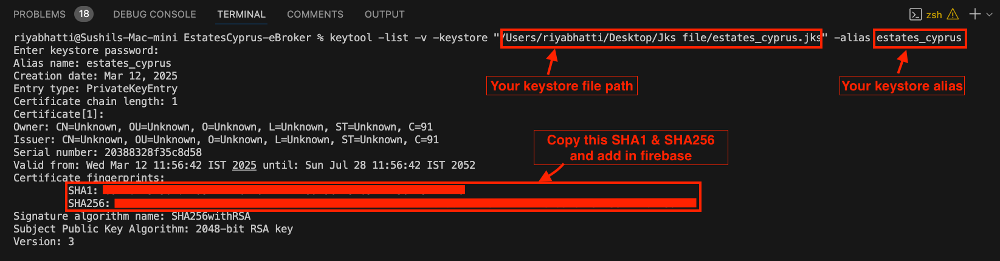    

---

#### 🔸 For App Signing

8️⃣ After Create the app on the Google Play Console, Go to **View app->**  
9️⃣ Go to Test and release > Setup > App Signing  
- Copy the SHA1 and SHA256 keys from `App signing key certificate` and paste into Firebase Console.  

  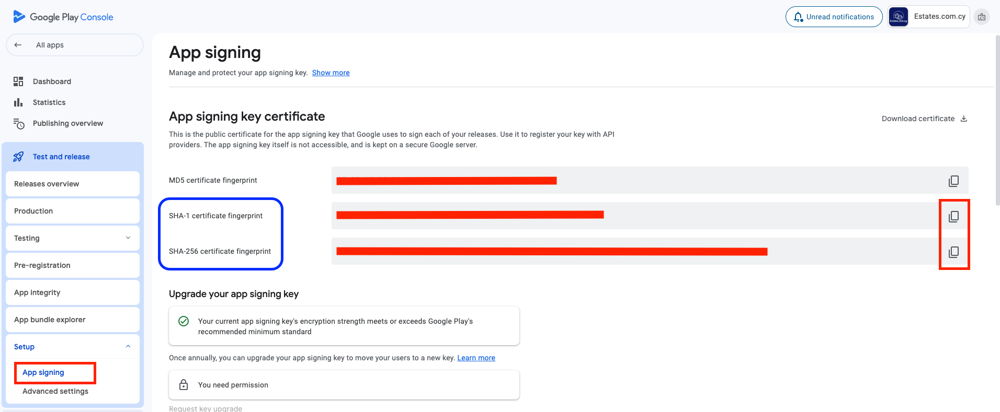  

--- 

### 🍎 For iOS Authentication Setup

1️⃣ Open Xcode > Open Your Project's **ios** folder  
2️⃣ Go to Signing & Capabilities tab  
3️⃣ Add Sign In With Apple capability  
4️⃣ Select a Team in the Code Signing section  

  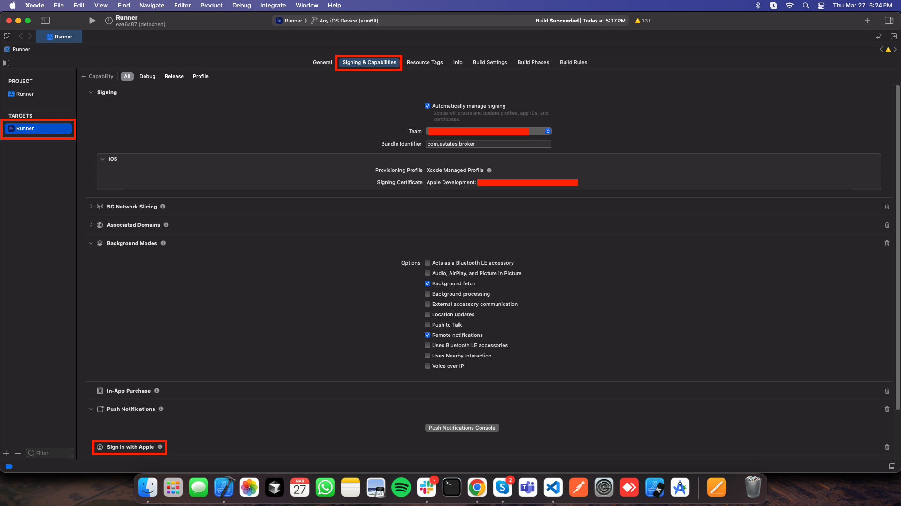  

#### 🔹 Configure URL Schemes for Firebase Authentication  

1️⃣ Select the Info tab under your project    
2️⃣ Expand URL Types  
3️⃣ Click + and add a new URL scheme  
4️⃣ Find `REVERSED_CLIENT_ID` inside **GoogleService-Info.plist**      
5️⃣ Copy and paste it into the URL Schemes field

  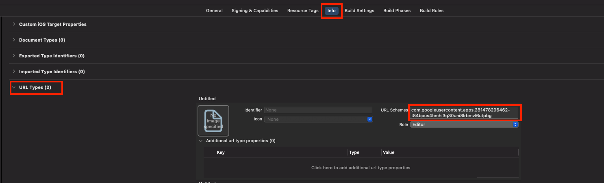  

6️⃣ Go to the Firebase Console > Project Settings > Apple apps  
7️⃣ Copy **Encoded App ID**

  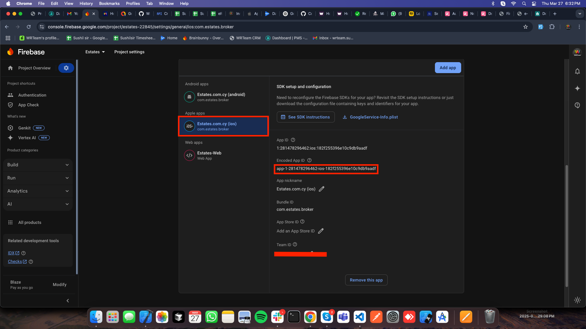  

8️⃣ Click + and add a new URL scheme (in Xcode)  
9️⃣ Paste the **Encoded App ID** into the URL Schemes field  

  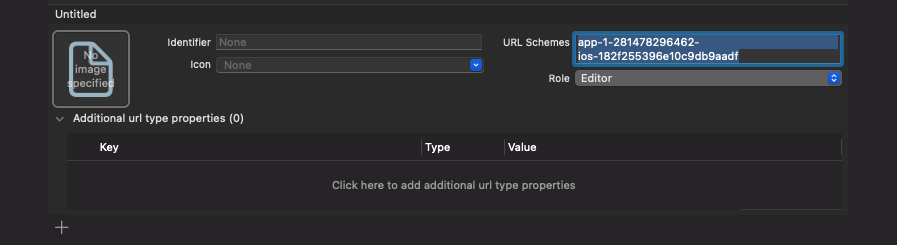  
  
---

#### ✅ Firebase Authentication🎉

