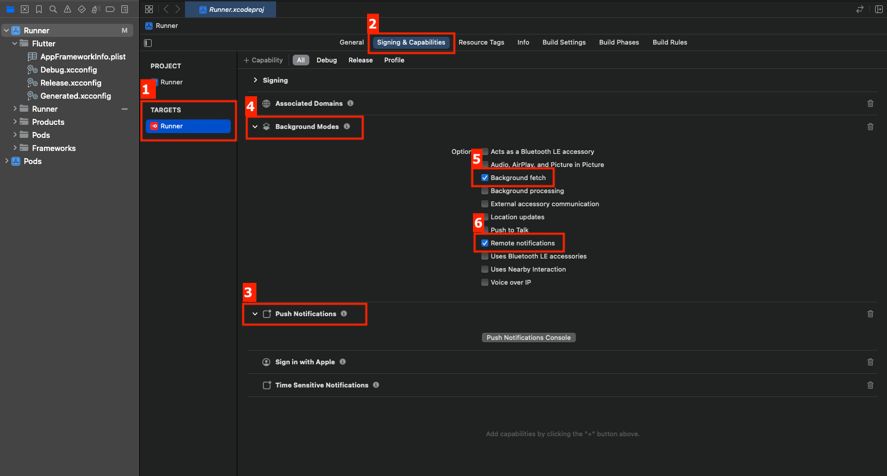
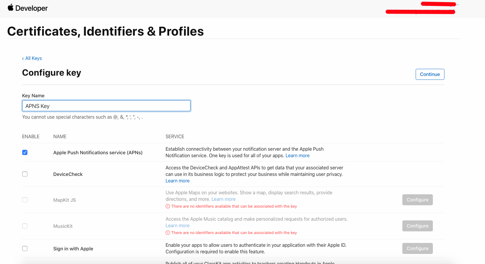
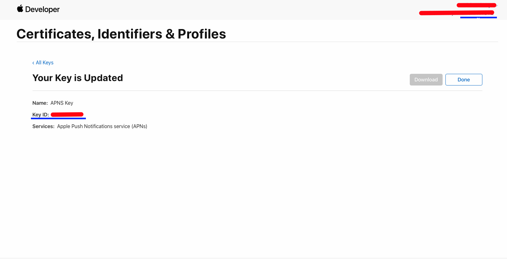
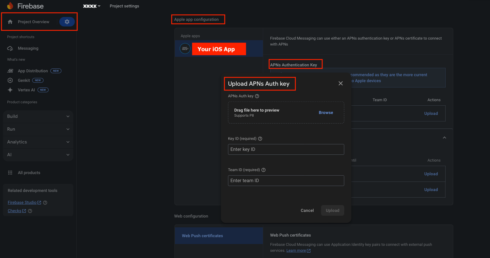

# Notifications

This guide walks you through the steps to Integrate Firebase Cloud Messaging  for your flutter Project. 

To enable Firebase Cloud Messaging (FCM) notifications, first register your application with Firebase. If you haven't already created a Firebase project, set one up. If a project already exists, you can skip this step.  

**Android** : All necessary dependencies, service classes, and configurations are already included in the project, so no additional coding is required. Simply download the **`google-services.json`** file and place it in your Flutter project at 📂 **`android/app/`** (replace the existing file if needed)

**iOS** : Follow these steps: 

1. Open your **ios folder** from IDE (VS code or Android Studio) OR **Runner.xcworkspace File** from Finder in Xcode and select your app's target.  
2. Enable **Push Notifications** under the **Capabilities** tab.  
3. Enable **Remote Notifications** and **Background Fetch** under **Background Modes**.
 

An **Apple Developer Account** is required to generate Apple Push Notifications for your project.

APNs supports two connection methods: **Token-based (.p8)** and **Certificate-based (.p12)**. You can use either based on your requirements.

Token-based (.p8) [Preferred] :

-> **Log in to the [Apple Developer Portal](https://developer.apple.com/account/)**  

-> **Enable Push Notifications:**
   - Navigate to **Certificates, Identifiers & Profiles > Identifiers**.
   - Select your App ID and enable **Push Notifications** under **Capabilities**.   
      

-> **Create SSL Certificates:**
   - Generate a **Certificate Signing Request (CSR)** using Keychain Access:
     - Open **Keychain Access** from `/Applications/Utilities/`.
     - Select **Keychain Access > Certificate Assistant > Request a Certificate from a Certificate Authority**.
     - Enter your email and a common name, choose "Saved to disk" and click **Continue**.
   - In the Developer Portal, create **Development** and **Production SSL Certificates** by uploading the CSR.
   

-> **Create a Universal APNs Key (Recommended):**
   - In the Developer Portal, go to **Certificates, Identifiers & Profiles > Keys**.
   - Click the add button (+) to create a new key.
   - Enable **Apple Push Notifications service (APNs)** and click **Continue**.
   - Name the key, register it, and download the **.p8** file. **Save this file securely**, as it can only be downloaded once.
        - Key ID (found in Apple Developer Portal under "Keys")
        - Team ID (found under Apple Developer account settings)
    
    

-> **Configure Firebase:**
   - In the [Firebase Console](https://console.firebase.google.com/), navigate to your project settings.
   - Under the **Cloud Messaging** tab, upload the **.p8** file and enter the **Key ID** and **Team ID**.
    

By following these steps, you'll successfully set up Push Notifications for your iOS app. 

Certificate-based (.p12) :

-> **Log in to the [Apple Developer Portal](https://developer.apple.com/account/)** 
-> **Enable Push Notifications:**  
   - Go to **Certificates, IDs & Profiles > Identifiers** and select your App ID.  
   - Enable **Push Notifications** under **Capabilities** and save.  
-> **Create an APNs Certificate:**  
   - Follow Apple's guide to [create a Certificate Signing Request (CSR)](https://developer.apple.com/help/account/certificates/create-a-certificate-signing-request/).  
   - In the Developer Portal, go to **Push Notifications > Configure** and create a **Development** or **Production SSL Certificate**.  
   - Upload the CSR, generate the certificate, and **download** it.  
-> **Export to .p12:**  
   - Open the **.cer** file in Keychain Access.  
   - Go to **File > Export Items**, select **.p12 format**, and save it securely.  
-> **Provisioning Profile:**  
   - Navigate to **Provisioning Profiles**, select the profile, edit if needed, and download it.  
   - Double-click to install it in Xcode.  
-> **Upload to Firebase:**  
   - Use the **.p12 file** in [Firebase Console](https://console.firebase.google.com/) under Cloud Messaging settings.
   

4. Replace the existing **`GoogleService-Info.plist`** with the latest one, or add it to your Flutter project at 📂 **`ios/Runner/`**

Now, your app is set up to receive push notifications! 🚀
