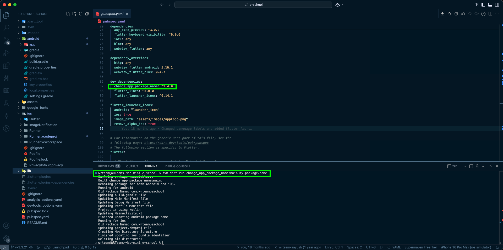

# Package Name Addition

## 📌 Importance of a Unique Package Name

A package name uniquely identifies your app on the Play Store and App Store. It must be unique to avoid conflicts during publishing and installation. If you don’t change the package name in the provided code, your app will use the default one, which is already in use. This will cause publishing errors and potential installation conflicts on devices.

### 🔹 How to Structure a Good Package Name

A package name typically follows a reverse domain format:  

```
com.<yourcompany>.<yourapp>
```

**Example:**
- If your company is "WRTeam" and your app is "eSchool," a good package name would be:  
  ```
  com.wrteam.eschool
  ```

#### Best Practices:
- Use only **lowercase letters** and **dots (`.`) as separators**.
- Avoid **special characters, spaces, or uppercase letters**.
- Ensure it matches across **Android**, **iOS**, and **Firebase** for consistency.
- 🔸 **Special Case for Kotlin Reserved Keywords:**  
  If your package name includes Kotlin reserved keywords like `in`, `is`, `as`, etc., you must wrap them in backticks when declaring the package in Kotlin source files.  
  **Example:**
  ```kotlin
  package `in`.co.mydomain.myapp
  ```

## 🔄 How to Change the Package Name

### Manual Method

You can manually search and replace the package name across your project files:

- `AndroidManifest.xml`
- `build.gradle`
- `Info.plist`
- `ios/Runner.xcodeproj/project.pbxproj`
- Rename the package structure inside:
  - `android/app/src/main/java/com/yourpackage/` *(for Java-based projects)*
  - `android/app/src/main/kotlin/com/yourpackage/` *(for Kotlin-based projects)*
- Any other occurrences in your Flutter project.

### Automated Method

Use the `change_app_package_name` package to simplify the process.

#### 1️⃣ Add Dependency

Include the following in your `pubspec.yaml` under `dev_dependencies`:

```yaml
dev_dependencies:
  change_app_package_name: any
```

#### 2️⃣ Run Command

Execute the following command in your terminal, replacing `<NEW_NAME_GOES_HERE>` with your desired package name:

```sh
dart run change_app_package_name:main <NEW_NAME_GOES_HERE>
```

This command will automatically update the package name for both **Android** and **iOS**.



### 🚨 Important Note

If the package name is also used in the configuration files of your Flutter code, you must update those manually to avoid conflicts.

✅ **Final Check:** Ensure your package name is updated correctly across all files before proceeding with development or publishing.
